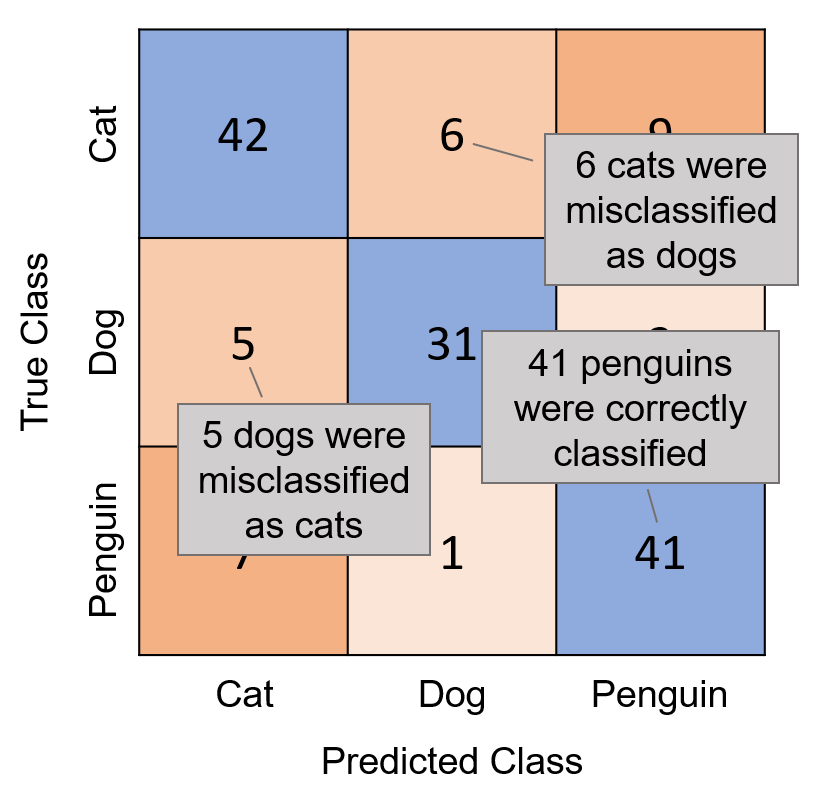
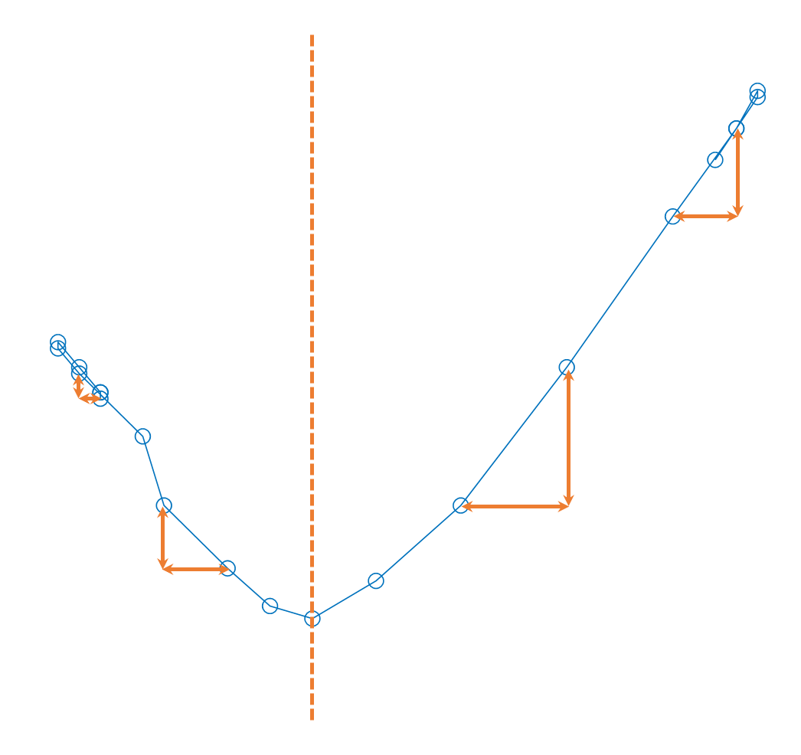
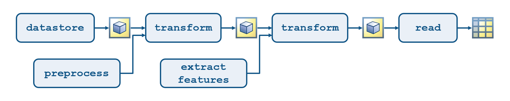
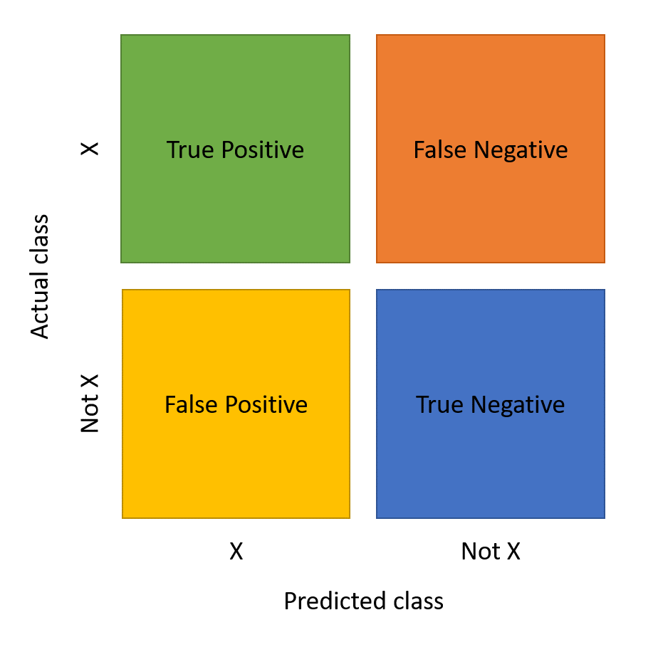
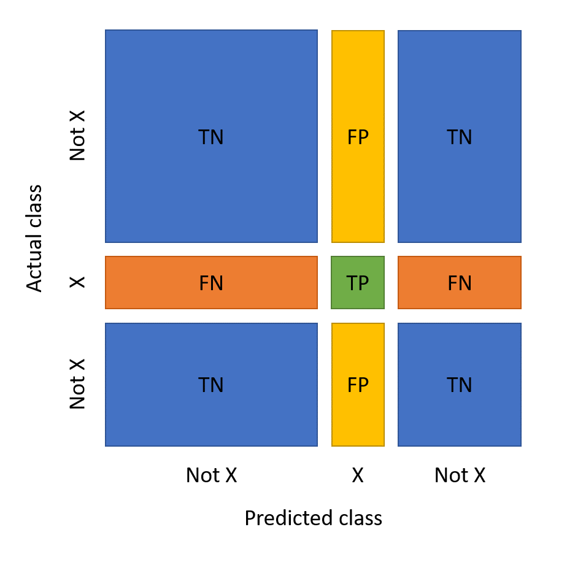
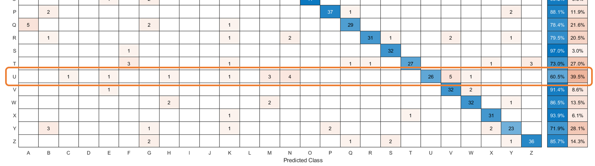

Classification Methods in Machine Learning

Table of Contents

- [Classification Workflow](#classification-workflow)
  - [1. Import Data](#1-import-data)
    - [a. `readtable`](#a-readtable)
    - [b. Dot notation](#b-dot-notation)
    - [c. `axis`](#c-axis)
  - [2. Process Data](#2-process-data)
    - [a. Numerical manipulation](#a-numerical-manipulation)
    - [b. Indexing](#b-indexing)
  - [3. Extract Features 1: Calculating Features](#3-extract-features-1-calculating-features)
    - [a. Feature](#a-feature)
    - [b. `range`](#b-range)
  - [4. Extract Features 2: Viewing Features](#4-extract-features-2-viewing-features)
    - [a. `scatter`](#a-scatter)
    - [b. `gscatter`](#b-gscatter)
  - [5. Build a Model](#5-build-a-model)
    - [a. `fitcknn`](#a-fitcknn)
    - [b. `predict`](#b-predict)
    - [c. Setting the $k$ in kNN](#c-setting-the-k-in-knn)
    - [d. Obtaining predictions for multiple observations](#d-obtaining-predictions-for-multiple-observations)
  - [6. Evaluate a Model](#6-evaluate-a-model)
    - [a. Using boolean operators to compare results](#a-using-boolean-operators-to-compare-results)
    - [b. Calculating accuracy](#b-calculating-accuracy)
    - [c. Calculating misclassification](#c-calculating-misclassification)
    - [d. Confusion matrix](#d-confusion-matrix)
  - [Review](#review)
- [Importing and Preprocessing Data](#importing-and-preprocessing-data)
  - [1. Creating Datastores](#1-creating-datastores)
    - [a. Wildcards](#a-wildcards)
    - [b. Importing data from datastore](#b-importing-data-from-datastore)
  - [2. Adding a Data Transformation](#2-adding-a-data-transformation)
    - [a. Function handle](#a-function-handle)
    - [b. `"omitnan"`](#b-omitnan)
- [Engineering Features](#engineering-features)
  - [1. Common Statistical Functions](#1-common-statistical-functions)
    - [a. Measures of Central Tendency](#a-measures-of-central-tendency)
    - [b. Measures of Spread](#b-measures-of-spread)
    - [c. Measures of Shape](#c-measures-of-shape)
  - [2. Finding peaks](#2-finding-peaks)
    - [a. Prominence](#a-prominence)
  - [3. Computing derivatives](#3-computing-derivatives)
    - [a. `diff`](#a-diff)
    - [b. `standardizeMissing`](#b-standardizemissing)
  - [4. Calculating Correlations](#4-calculating-correlations)
    - [a. `corr`](#a-corr)
    - [b. Index-based correlation coefficient](#b-index-based-correlation-coefficient)
  - [5. Automating Feature Extraction](#5-automating-feature-extraction)
  - [6. Extracting Features from Multiple Data Files](#6-extracting-features-from-multiple-data-files)
- [Classification Models](#classification-models)
  - [1. Building Classification Model](#1-building-classification-model)
  - [2. Training A Model](#2-training-a-model)
    - [a. `classificationLearner`](#a-classificationlearner)
  - [3. Making Predictions with a Classification Model](#3-making-predictions-with-a-classification-model)
  - [4. Investigating Misclassifications](#4-investigating-misclassifications)
    - [a. Identifying Common Misclassifications](#a-identifying-common-misclassifications)
      - [<b>False Negatives</b>](#bfalse-negativesb)
  - [5. Investigating Features](#5-investigating-features)
  - [Improving the Model](#improving-the-model)
    - [Data organisation and preprocessing](#data-organisation-and-preprocessing)
    - [Data exploration & Feature engineering](#data-exploration--feature-engineering)
    - [Model building](#model-building)
    - [Model evaluation](#model-evaluation)

When a machine learns from a given training set of data, then applies the knowledge learned to interpret a given dataset - this is known as Machine Learning (ML).

There are many models in which a machine can follow to *learn* a training set, including but not limited to:

- ***k***-Nearest Neighbours (kNN)
- Support Vector Machine (SVM)
- Naive Bayes (NB)
- Discriminant Analysis
- Decision Tree
  
Oftentimes, one does not need to understand how each and every model works. Rather, one can use the training set on every model and examine which algorithm works the best. When it comes to fitting the training set to a particular model, one must consider the tug of war between:

- a simple model that loosely describes the training/testing set with relatively decent accuracy and;
- an overfitted model that accurately describes the training set, but not the testing set.

When a training set gives good correlation for a particular model but not for the testing set, this is called *overfitting*.

<center>
<i>Table 1. Training vs testing for different models example</i>

| | kNN | SVM | NaiveBayes | DA | DT |
| :---: | :---: | :---: | :---: | :---: | :---: |
| Training | O | X | O | X | O |
| Testing | X | X | O | X | X |
</center>

This onramp covers the following:
- Importing data
- Preprocessing data
- Extracting features
- Building a model
- Evaluating a model


# Classification Workflow
## 1. Import Data
### a. `readtable`
One can use the `readtable` function to import tabular data from a spreadsheet or text file and store the result as a table.

```matlab
data = readtable("<filename>.<extension>")
```
This imports the data from the spreadsheet with the name `<filename>` with the extension `<extension>` and stores it in a table called `data`.

### b. Dot notation
Dot notation can be used to refer to any individual variable within a table.
```matlab
x = mytbl.Xdata;
y = mytbl.Ydata;
```
This extracts the variable `Xdata` from the table `mytbl` and stores the result in a new variable called `x`. This is true for `Ydata` from `mytbl` to `y` as well.

### c. `axis`
When plotting, the default axis limits may distort the aspect ratio of the plot. `axis` command be used to force the axes to preserve the aspect ratio of the data, such as:
```matlab
axis equal
```

## 2. Process Data
### a. Numerical manipulation
Variables in a table can be extracted, modified and reassigned while in dot notation -- as with any variables.
```matlab
n = n + 3;
data.X = data.X * 1.5;
```

### b. Indexing
Variables in a table can be indexed -- as with any variables.
```matlab
firstX = data.X(1);
finalX = data.X(end);
```

## 3. Extract Features 1: Calculating Features
### a. Feature
A *feature* is simply a value calculated from the signal, such as its duration or length.
```matlab
duration = table.Time(end);
```
### b. `range`
The `range` function returns the range of values in an array. That is, `range(x)` is equvalent to `max(x) - min(x)`.
```matlab
% calculating aspect ratio of Y over X
ratio = range(data.Y) / range(data.X);
```

## 4. Extract Features 2: Viewing Features
### a. `scatter`
For a table containing two columns, `scatter` function can be used to plot the extracted features.
```matlab
scatter(data.X, data.Y)
```

### b. `gscatter`
If `scatter` is not enough to distinguish the data set (notably in tables with multiple columns), `gscatter` can be used instead. It is reminiscent of the `color` key in the `aes` argument in python's `ggplot`.

```matlab
gscatter(data.X, data.Y, data.G)
```

## 5. Build a Model
### a. `fitcknn`
A simple model is to classify an observation as the same class as the nearest known examples. This is called a *$k$-Nearest Neighbour* (kNN) model. a kNN model can be fit by passing a table of data to the `fitcknn` function.
```matlab
knnmodel = fitcknn(data,"ResponseVariable");
```
The second input is the name of the response variable in the table i.e. the class you want the model to predict. The output is a variable containing the fitted model.
### b. `predict`
The `predict` function determines the predicted clas of new observations.
```matlab
predictClass = predict(model,newdata)
```
The inputs are the trained model and new observations. The output is a categorical array of the predicted class for each observation in `newdata`. 

Typically, the new observations are in the form of a table with the same predictor variables as were used to train the model. If the model uses $N$ number of numeric features, then observations can also be provided as a numeric array that contains $N$ columns.

### c. Setting the $k$ in kNN
The value of $k$ in a kNN model can be specified by setting the `"NumNeighbors"` property when calling `fitcknn`.
```matlab
% kNN model with 10 neighbours
model = fitcknn(data,"ResponseVariable",...
"NumNeighbors",10);
```

### d. Obtaining predictions for multiple observations

Does changing the number of neighbours change the prediction on the test observation? Which prediction is better? How can you evaluate your model from its predictions?

Predictions for multiple observations can be obtained by passing a matrix/table of new data to the `predict` function. 
```matlab
predictions = predict(knnmodel,features)
```

The categorical output arrays can then be concatenated to see the predictions and true classes side-by-side.
```matlab
[predictions, features.Class]
```


## 6. Evaluate a Model
Predictions can be made by using the model, but it does not evaluate how *good* it is. Models therefore need to be tested by having them make predictions on observations for which the correct classification is known.

### a. Using boolean operators to compare results
Consider a file `featuredata.mat` containing a table `testdata` that has the same variables as `features` (including the known classes for the test observations). The observations in `testdata` however, are not included in `features`. You can use the `predict` function to determine the kNN model's predictions for the observations in `testdata` and then compare the predictions to the known classes to see how well the model performs on new data.


```matlab
% store the predictions in var predictions
predictions = predict(knnmodel,testdata)

% compare predictions to the known classes
iscorrect = predictions == testdata.Class
```
### b. Calculating accuracy
Proportion of correct predictions can be calculated by:
<center>

$\displaystyle \frac{P_{\text{correct}}}{ \sum P}$

</center>

`sum` function can be used to determine othe number of correct predictions $P_{\text{correct}}$ while `numel` function can be used to determine the total number of predictions $\sum P$ in such as way that:
```matlab
accuracy = sum(iscorrect) / ...
numel(predictions)
```
### c. Calculating misclassification
Rather than accuracy, a commonly-used metric to evaluate a model is *misclassification rate* i.e. the proportion of incorrect predictions. Boolean operator `~=` can be used here.

```matlab
iswrong = predictions ~= testdata.Class
misclassrate = sum(iswrong) / ...
numel(predictions)
```

### d. Confusion matrix
Accuract and misclassification rate give a single value for the overall performance of the model, but it can be useful to see a more detailed breakdown of which classes the model confuses. 

A *confusion matrix* shows the number of observations for each combination of true and predicted class.



A confusion matrix is commonly visualised by shading the elements according to their value. Often othe diagonal elements (the correct classifications) are shaded in one colour and the other elements (the incorrect classifications) in another colour. Confusion matrix can be visualised via the `confusionchart` function.

```
confusionchart(y_true,y_pred)
```
where `y_true` is a vector of the known classes and `y_pred` is a vector of the predicted classes.

## Review
```matlab
%% Example of training letter prediction
% load dta
load featuredata13letters.mat
features
testdata

% gscatter where 0 <= x <= 10
gscatter(features.AspectRatio,features.Duration,features.Character)
xlim([0 10])

% train with 5 neighbours
knnmodel = fitcknn(features,"Character","NumNeighbors",5);
predictions = predict(knnmodel,testdata);

% calculate misclassification 
misclass = sum(predictions ~= testdata.Character)/numel(predictions)

% generate confusionchart
confusionchart(testdata.Character,predictions);
```


# Importing and Preprocessing Data

When handling data, it is unlikely that every data will be stored in one file. In the example of handwriting prediction, each sample of each letter is stored in a separate file. How can those hundreds of files by organised & how do we know which letter is represented in each file? Some options are: 
1. Have a folder for each letter or;
2. Have one folder with all the files with the letter in the filename (e.g. `writer_< A to Z >_< L or R >`) or;
3. Have separate file that has a lookup table of the files and the letters they contain.

If we're working with an existing dataset, then we typically work with the data <u>*as it's stored*</u>. That is, if possible, we should think about the organisation of the files before collecting the data so that we can have the data in the most convenient arrangement. This depends on the problem we're studying. If we are to classify letters, then we'd have a folder for each letter. If we are to classify left-handed vs right-handed, we would need a different arrangement.

Regardless of how data is stored, MATLAB offers `datastore` - which provides a convenient way to access the stored data across multiple files. Unlike `readtable` which imports everything at once when called, `datastore` in MATLAB provides information about the files and the format of their contents while the <u>data itself is not imported unless asked via `read` function</u>. This way we can control what we grab and when.

Oftentimes, the filename contains a lot of information about the observation. In this case, functions like `extractBetween` can be used to extract necessary data. If we are using a separate datainfo table, then we can `read` that table then `join` it to the associated data.

This section covers the procedures involved in creating a datastore, and processing the data in these files so that we are ready to extract information from the data and build predictive models.

## 1. Creating Datastores
### a. Wildcards
We can use wildcards to make a datastore to files or folders matching a particular pattern.
```matlab
M = datastore("*_M_*.csv")
```
In this case, all `csv` files containing `_M_` will be extracted and saved as a variable named `M`. 

### b. Importing data from datastore
`read` function can be used to import the data from a file in the datastore in the form of:
```
data = read(datastore)
```
Alternatively, `readall` function can be used to import everything in the delegated datastore. However, by doing so, there is no simple way to determine where the data from one file ends and the data from the next file begins.

## 2. Adding a Data Transformation
Custom functions can be added <b>at the end</b> of the script for data preprocessing, which would look something like:
```matlab
function data_out = fnName(data_in)
    % do something
    data_out = ...
end
```
### a. Function handle
To use a function as an input to another function, create a *function handle* by adding the `@` symbol to the beginning of the function name. For example:
```matlab
preproc_ds = transform(ds,@func)
```
passes the var `ds` into function `func` first, uses its out to `transform`, then stores the output as `preproc_ds`.

### b. `"omitnan"`
Proprocessing typically involves normalisation of data, such as:
```matlab
data.X = data.X - mean(data.X);
data.Y = data.Y - mean(data.Y);
```
Any calculations (incl. the default use of functions such as `mean`) involving `NaN`s will result in `NaN`. This is important in ML where it is possible to have missing values in our data. In the above example, if `data.X` contained a `NaN` value, then attempting to visualise `data.X, data.Y` will result in a blank plot. To mitigate this, we can pass the `"omitnan"` option to have statistical functions like `mean` to ignore missing values. e.g.
```matlab
mean(data.X, "omitnan")
```

# Engineering Features

## 1. Common Statistical Functions
### a. Measures of Central Tendency
<center>

| Function | Description |
| :--- | :--- |
| [`mean`](https://au.mathworks.com/help/matlab/ref/mean.html) | Arithmetic mean |
| [`geomean`](https://au.mathworks.com/help/matlab/ref/geomean.html) | Geometric mean |
| [`harmean`](https://au.mathworks.com/help/matlab/ref/harmean.html) | Harmonic mean |
| [`median`](https://au.mathworks.com/help/matlab/ref/median.html) | Median value |
| [`mode`](https://au.mathworks.com/help/matlab/ref/mode.html) | Most frequent value |
| [`trimmean`](https://au.mathworks.com/help/matlab/ref/trimmean.html) | Trimmed mean (mean, excluding outliers)|  
| | |

</center>

### b. Measures of Spread
<center>

| Function | Description |
| :--- | :--- |
| [`range`](https://au.mathworks.com/help/matlab/ref/range.html) | `max() - min()` |
| [`std`](https://au.mathworks.com/help/matlab/ref/std.html) | Standard deviation |
| [`var`](https://au.mathworks.com/help/matlab/ref/var.html) | Variance |
| [`mad`](https://au.mathworks.com/help/matlab/ref/mad.html) | Mean absolute deviation |
| [`iqr`](https://au.mathworks.com/help/matlab/ref/irq.html) | Interquartile range |
| | |

</center>

### c. Measures of Shape
<center>

| Function | Description |
| :--- | :--- |
| [`skewness`](https://au.mathworks.com/help/matlab/ref/skewness.html) | Skewness (3rd central moment) |
| [`kurtosis`](https://au.mathworks.com/help/matlab/ref/kurtosis.html) | Kurtosis (4th central moment) |
| [`moment`](https://au.mathworks.com/help/matlab/ref/moment.html) | Central moemnt of arbitrary order |
| | |
</center>

## 2. Finding peaks
Local minima and maxima are often important features of a signal. The `islocalmin` and `islocalmax` functions take a signal as input and return a logical array othe same length as the signal.
```matlab
idx = islocalmin(x)
```
The value of `idx` is `True` whenever the corresponding value in the signal is a local minimum.

### a. Prominence
Local minima and maxima are defined by computing the *prominence* of each value in the signal. The prominence is a measure of how a value compared to the other values around it. We can obtain the prominence value of each point in a signal by obtaining a second output from `islocalmin` or `islocalmax`.
```matlab
[idx, prom] = islocalmin(x);
plot(data.Class,prom)
```

By default, `islocalmin` and `islocalmax` find points with any prominence value > 0. This means that a maximum is defined as any point that is larger than the two values on either side of it. For noisy signals, we may want to consider only minima and maxima that have a prominence value above a given threshold `"MinProminence"`.
```matlab
idx = islocalmin(x,"MinProminence",<threshvalue>)
```
Note: when choosing a threshold value, prominence values can only range from `0` to `range(x)`.

## 3. Computing derivatives
### a. `diff`
The `diff` function calculates the difference between successive elements of an array. That is, if `y = diff(x)` then

<center>

$\displaystyle y_k = x_{k+1} - x_k$

</center>

Note that `y` will be one element shorter than `x`. 

```matlab
% calculate the approximate derivative
dX = diff(data.X);
dT = diff(data.Time);
dXdT = dX ./ dT;

% recall that y is one element shorter than x
plot(Time(1:end-1), dXdT)
```

### b. `standardizeMissing`
When calculating the derivatives, some arrays contain values that result in `-Inf` or `Inf` due to division by 0. To address this, a vector of values may be passed to `standardizeMissing` to deal with multiple missing values at once.
```matlab
% deal with +infinity
xstan = standardizeMissing(x, Inf);

% can pass multiple values
xstan = standardizeMissing(x,[-Inf, 0, Inf])

```

## 4. Calculating Correlations
Examine the image provided below, which analyses handwritten 'V'. For the first half of the letter V, the horizontal and vertical positions have a strong negative linear correlation: when the horizontal position increases, the vertical position decreases proportionally. Similarly, for the second half, the positions have a strong positive correlation: when the horizontal position increases, the vertical position also increases proportionally.



### a. `corr`
The `corr` function calculates the linear correlation between variables. Because some variables may contain missing data, the output may equal `NaN`. In this case, `"Rows"` option can be used to specify how to avoid missing values.

```matlab
C = corr(x,y,"Rows","complete")
```

### b. Index-based correlation coefficient
The correlation coefficient is always between -1 and +1. 
- A coefficient of -1 indicates a perfect negative linear correlation.
- A coefficient of +1 indicates a perfect positive linear correlation.
- A coefficient of 0 indicates no linear correlation.

In this case of our "V", there is only a moderate correlation because the calculation has been performed on the entire signal at once. It may be more informative to consider the two halves of the signal separetely. 

We first create a matrix $M$ defined as var `M` using four columns via concatenation:

<center>

<a href="https://www.codecogs.com/eqnedit.php?latex=\dpi{150}&space;\fn_phv&space;\large&space;M&space;=&space;\begin{bmatrix}&space;v_{X1}&space;&&space;v_{X2}&space;&&space;v_{X3}&space;&&space;\dots&space;&&space;v_{X11}\\&space;v_{Y1}&space;&&space;v_{Y2}&space;&&space;v_{Y3}&space;&&space;\dots&space;&&space;v_{Y11}\\&space;v_{X12}&space;&&space;v_{X13}&space;&&space;v_{X14}&space;&&space;\dots&space;&&space;v_{X22}\\&space;v_{Y12}&space;&&space;v_{Y13}&space;&&space;v_{Y14}&space;&&space;\dots&space;&&space;v_{Y22}\\&space;\end{bmatrix}" target="_blank"></a>

</center>

```matlab
M = [v.X(1:11) v.Y(1:11) v.X(12:22) v.Y(12:22)]
```
then calculate the correlation between each pair of several variables by passing the matrix $M$ to the `corr` function, where each variable is a column of the matrix:

```matlab
Cmat = corr(M,"Rows","complete")
```

The output `Cmat` is a 4-by-4 matrix of the coefficiencts of correlation between each pairwise combination of the columns of `M`. That is, `Cmat(i,j)` is the correlation of `M(:,i)` and `M(:,j)`. The matrix is symmetric because the correlation between `x` and `y` is the same as the correlation between `y` and `x`. The diagonal elements are always equal to 1 because a variable is always perfectly correlated with itself.

<center>

<a href="https://www.codecogs.com/eqnedit.php?latex=\dpi{150}&space;\fn_phv&space;\large&space;\texttt{Cmat}&space;=&space;\small&space;\begin{bmatrix}&space;v_{X1\to11},v_{X1\to11}&space;&&space;v_{X1\to11},v_{Y1\to11}&space;&&space;v_{X1\to11},v_{X12\to22}&space;&&space;v_{X1\to11},v_{Y12\to22}\\&space;v_{Y1\to11},v_{X1\to11}&space;&&space;v_{Y1\to11},v_{Y1\to11}&space;&&space;v_{Y1\to11},v_{X12\to22}&space;&&space;v_{Y1\to11},v_{Y12\to22}\\&space;v_{X12\to22},v_{X1\to11}&space;&&space;v_{X12\to22},v_{Y1\to11}&space;&&space;v_{X12\to22},v_{X12\to22}&space;&&space;v_{X12\to22},v_{Y12\to22}&space;\\&space;v_{Y12\to22},v_{X1\to11}&space;&&space;v_{Y12\to22},v_{Y1\to11}&space;&&space;v_{Y12\to22},v_{X12\to22}&space;&&space;v_{Y12\to22},v_{Y12\to22}\\&space;\end{bmatrix}" target="_blank"></a>

</center>

## 5. Automating Feature Extraction
Say we have imported a datatable called `dt` which contains three Classes of information: `X`, `Y` and `Time`. We also woud have written some lines of code to extract statistical data out of them. We can automate this extraction process by turning it into a function where we store statistical data into a `table`:

```matlab
function feature = extract(data)
aratio = range(dt.Y)/range(dt.X);
idxmin = islocalmin(dt.X,"MinProminence",0.1);
numXmin = nnz(idxmin);
idymax = islocalmax(dt.Y,"MinProminence",0.1);
numYmax = nnz(idymax);
dT = diff(dt.Time);
dXdT = diff(dt.X) ./ dT;
dYdT = diff(dt.Y) ./ dT;
meandX = mean(dXdT,"omitnan");
meandY = mean(dYdT,"omitnan");
corrXY = corr(dt.X, dt.Y,"Rows","complete");
label = ["AspectRatio", "NumMinX", "NumMinY", "AvgU", "AvgV", "CorrXY"];

feat = table(aratio,numXmin,numYmax,avgdX,avgdY, corrXY, 'VariableNames', label)
```
## 6. Extracting Features from Multiple Data Files


From the raw data, we will typically need to apply both [preprocessing](#importing-and-preprocessing-data) and [feature extraction](#3-extract-features-1-calculating-features) functions.

```matlab
X_ds = datastore("*.csv");

X_scaled = transform(X_ds,@scale);

X_extracted = transform(X_scaled,@extract);
```

# Classification Models

## 1. Building Classification Model
<u>Classification</u>

When you want to put an observation into one of a discrete set of classes(boy/girl, cat/dog)

<u>Model</u>

A mathematical recipe that turns data into one of said output classes. 

In a traditional modeling approach, one ought to know the complexity and intracacies of how the system works in order to build a model. However, many real-world problems are too complicated for this to work. In the realm of ML, <b>one builds the model from data instead</b>. That is, a machine learning algorithm is applied to a real data and let the machine learn from those examples -- such as mapping the inputs to the desired outputs.

## 2. Training A Model
It is possible that depending on our training data, we can introduce bias(es) to our model. We can examine the distribution bias by using the `histogram` function:
```matlab
load data.mat
traindata

histogram(traindata.Class)
```

We can also calculate MADX (mean absolute deviation of the X-axis) and then plot it using `boxplot`
```matlab
boxplot(traindataMADX,traindata.Class)
```

### a. `classificationLearner`
Enter the command `classificationLearner` to open the Classification Learner app. 
1. Choose `traindata` 
2. The app should detect `traindata.Class` as the response variable to predict
3. Select validation options
4. Select a model and click the <b>Train</b> button

Try a few models with default options and <b>see if you can achieve at least 80% accuracy.</b>

Note that SVMs work on binary classification problems i.e. where there are only two classes. To make SVMs work on problems involving multiple classes, the app will need to fit many SVMs which will therefore be slow to train. Similarly, ensemble methods work by fitting multiple models. These will also be slow to train.

## 3. Making Predictions with a Classification Model

Recall that we can use `predict` function to obtain a model's predictions for new data, such that:
```matlab
pred_j = predict(<model>,testmodel);
```
In the cases where the correst classes for the test data are known, we can calculate the misclassification rate:
```matlab
wrong = pred_j ~= testmodel.Class;
missclasrate = sum(wrong)/numel(wrong)
```
Since the the response classes are not always equally distributed in either the training nor the test data, `loss` is a fairer measure of misclassification that incorporates the probability of each class (based on the distribution in the data).

```matlab
loss(<model>,testmodel)
```

We can calculate the loss on any dataset where the correct class is known. The loss of the original training data is known as the <b>resubstitution loss</b> i.e. the loss when the training data is "resubstituted" into the model. We can calculate the resubstitution loss directly with `resubLoss(<model>)`.

## 4. Investigating Misclassifications




For any response class $X$, we can divide a machine learning model's predictions into four groups:

- TRUE POSITIVE - predicted to be $X$, was $X$.
- TRUE NEGATIVE - predicted to be not $X$, was not $X$.
- FALSE POSITIVE - predicted to be $X$ but was not $X$.
- FALSE NEGATIVE - predicted to be not $X$ but was $X$.

With multiple classes, the false negatives and false positives will be given by a whole row or column of the confusion matrix (exception for the diagonal element that represents the true positive).

### a. Identifying Common Misclassifications

When making a confusion chart, we can add information about the FALSE NEGATIVE and FALSE POSITIVE rate for each class by adding row or column summaries, respectively:
 
```matlab
confusionchart(...,"RowSummary","row-normalized")
```

#### <b>False Negatives</b>
Typically the values in confusion charts are made visible. Howeverm, in the example of predicting alphabets from handwriting there are 26 Classes to consider, making it a 26x26 table. Upon resizing, the row summary will show the false negative rates for each Class. This shows which Classes the kNN model has the most difficulty identifying.  



In the example given above, the model has particular difficulty with the letter U, most often mistaking it for M, N or V. Some confusions seem reasonable, such as U/V or H/N. Others are more surprising, such as U/K. Having idenfitied misclassifications of interest, we will want to look at some of the specific data samples to understand what is causing the misclassification. We can use relational & logical operators (e.g. `==`, `~=`, `&` and `|`) to identify observations to study this further. For example,

```matlab
% combine two following conditions:
% 1. which were in the testdata that equalled to class "U"?
% 2. which were in the prediction that did not equal to class "U"?
falsenegative = testdata.Character == "U" & predLetter ~= "U"

```

Here the variable `falsenegative` is a logical array which can be used as an index back into the datastore, or into the prediction array. This may look a bit like:

```matlab
>> fnfiles = testfiles(falsenegative)
>> fnfiles = %17x1 string
"user004_U_1.txt"
"user007_U_1.txt"
    .
    .
    .
```
and

```matlab
>> fnpredict = testfiles(falsenegative)
>> fnpredict = % 17x1 categorical
    K
    V
    V
    .
    .
    .
```

## 5. Investigating Features
Having identified examples of interest, we will typically want to examine the corresponding features. In this case, we use logical indexing to extract the <b>training data</b> for just the letters `N` and `U`. Similarly, we extract the <b>test data</b> where the letter `U` was misclassified i.e. the false negatives for U.

```matlab
idx = (traindata.Character == "N") | (traindata.Character == "U");
UorN = traindat(idx,:)

idx = (testdata.Character == "U") & (predLetter ~= "U");
falseneg_U = testdata(idx,:)
```
Categorical variables maintain the full list of possible classes, even when only a subset are present in the data. When examining a subset, it can be useful to redefine the set of possible classes to only those taht are in the data. The `removecats` function removes unused categories:

```matlab
cmin = removecats(cfull)
```

Curly braces can be used to extract data from a table into a array of a single type.

```matlab
datamatrix = datatable{1:10,4:6}
```
This extracts the first 10 elements of variables 4, 5 and 6. If these variables are numeric, `datamatrix` will be a 10-by-3 double array.
If we want to extract the numeric data from `UorN` and `falseneg_U` to `UorNfeat` and `falseneg_Ufeat` respectively:

```matlab
% {rows, vars}
% we want every row and every var except the last one which is the response. All other variables are the features.
UorNfeat = UorN{:,1:end-1};
falseneg_Ufeat = falseneg_U{:,1:end-1}
```

A <i>parallel coordinates</i> plot shows the value of the features (or "coordinates") for each observation as a line. To compare the feature values of different Classes, use the "Group" option such that:

```matlab
parallelcoords(UorNfeat,"Group",UorN.Character)
```

## Improving the Model
Even if your model works well, we will typically want to look for improvements before deploying it for use. Theoretically, we could try to improve the results at any part of the workflow. However, collecting data is typically the most difficult step of the process - which means we often have to work with the data we have. 

### Data organisation and preprocessing

If we have the option of collecting more data, we have always use the insights gained so far to inform what new data we might need to collect.

### Data exploration & Feature engineering

Low accuracy in both training and testing sets is an indication that our features do not provide enough information to distinguish the different classes. In particular, it is important to highlight where the classes are frequently confused to see if there are characterstics that we can capture as new features. That being said, too many features also poses a problem of its own. Redundant or irrelevant features often lead to low accuracy and increase the chance of overfitting. This is especially true for when no significant performance is observed upon adding features. On MATLAB, it is possible to use a feature selection technique to find and remove features that do not add to the overall performance of the model. We can also feature transformation to perform a change of coordinates on our features. With a technique such as principal component analysis (PCA), the transformed features are chosen to minimise redundancy and ordered by how much information they contain.

### Model building

MATLAB's classification learner app providers an easy way to experiment with different models. In the case of kNN models, we can vary the number of neighbours, weighting of the neighbours based on distance and the way that distance is defined and so on. 
 
Some classification methods are extremely sensitive to the training data, which means we may get very different predictions from different models trained on different subsets of the data. This can be harnessed as a strength by creating an ensemble - training a large number of these so-called weak leaners on different permutations of the training data and using the distribution of individual predictions to make the final prediction.

### Model evaluation

When it comes to evaluating different models, it is quintessential to have an accurate measure of a model's performance. The simplest and cheapest way to do validation is <b>holdout</b> - randomly dividing your data into a training set and a testing set. This works for large data sets, but for many real life problems, holdout validation can result in the test accuracy being dependent on the specific choice of test data. 

We can use k-fold cross-validation to get a more accurate estimate of performance. In this case, multiple models are trained and tested, each on a different division of the data. The reported accuract is the average from the different models.

Accuracy is onle one simple metric for measuring model's performance. It is also crucial to consider the confusion matrix, false negative rates and false positive rates. Furthermore, the practice impact of a false negative may be significantly different to that of a false positive. For example, a false positive medical diagnosis may cause stress and expense, but a false negative could be fatal. In these cases, we can incorporate a cost matrix into the calculation of a model's loss.

