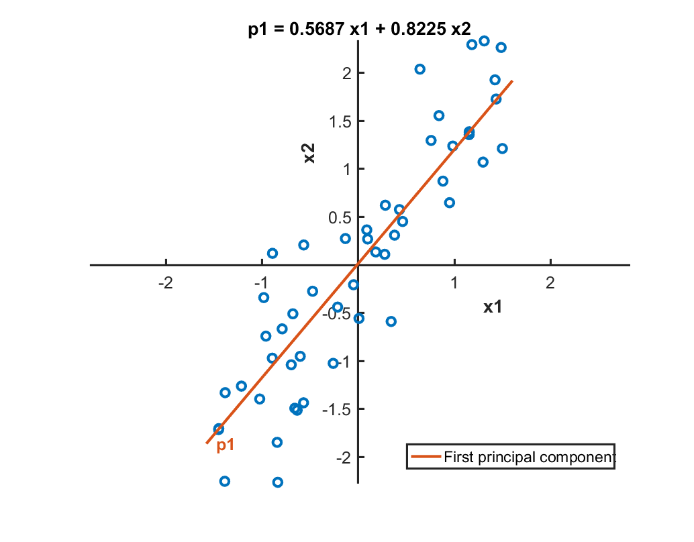
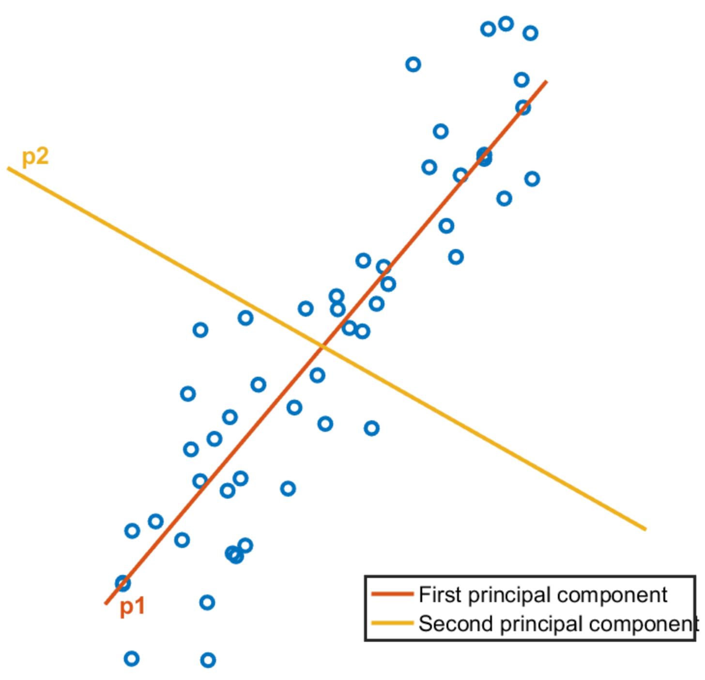
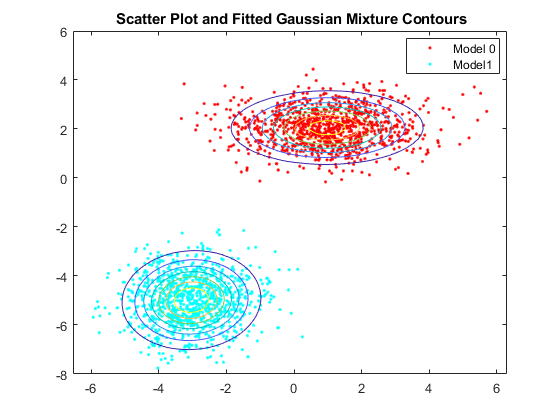
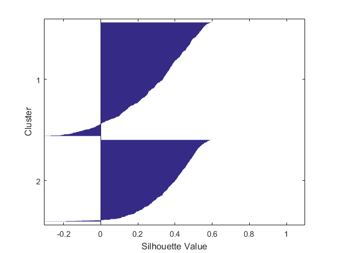

Table of Contents
- [Finding Patterns in Data](#finding-patterns-in-data)
  - [1. Low Dimensional Visualisation](#1-low-dimensional-visualisation)
    - [a. Dimensionality Reduction Techniques](#a-dimensionality-reduction-techniques)
    - [b. Multidimensional Scaling (MDS)](#b-multidimensional-scaling-mds)
      - [i. Classical MDS](#i-classical-mds)
      - [ii. Non-classical MDS](#ii-non-classical-mds)
    - [c. Principal Component Analysis (PCA)](#c-principal-component-analysis-pca)
      - [i. Result interpretation](#i-result-interpretation)
  - [2. k-Means Clustering](#2-k-means-clustering)
  - [3. Gaussian Mixture Models](#3-gaussian-mixture-models)
    - [a. Fitting Gaussian Distributions](#a-fitting-gaussian-distributions)
    - [b. Identifying Clusters](#b-identifying-clusters)
  - [4. Interpreting the Clusters](#4-interpreting-the-clusters)
    - [a. Visualisation of Observations in Clusters](#a-visualisation-of-observations-in-clusters)
    - [b. Cross-tabulation](#b-cross-tabulation)
    - [c. Cluster Quality Evaluation](#c-cluster-quality-evaluation)
  - [5. Hierarchical Cluster Analysis (HCA)](#5-hierarchical-cluster-analysis-hca)
    - [a. Determining the Hierarchical Cluster](#a-determining-the-hierarchical-cluster)
    - [b. Dividing Hierarchical Tree into Clusters](#b-dividing-hierarchical-tree-into-clusters)
    - [c. Example](#c-example)

# Finding Patterns in Data

The goal of unsupervised learning problems is to identify the natural patterns or groupings in a dataset. As an example, let's examine a table containing information about basketball players:

| *Player* | Height | Weight | Points | Rebounds | Blocks | Assists |
| :--: | :--: | :--: | :--: | :--: | :--: | :--: |
| A | | | | | | |
| B | | | | | | |
| C | | | | | | |
| D | | | | | | |
| E | | | | | | |
| ... | | | | | | |
| Z | | | | | | |

On what basis can we divide the players? In basketball, players are divided into three groups of positions - Guards; Forwards and Centres. Teams generally rely on these three positions when choosing their players with the assumption that players who play the same position will have similar sets of skills and statistics. *But we don't know that ... yet.*

Back to our ML. With enforcing any prior knowledge about basketball, unsupervised learning can be used to divide the players' statistics into groups. Once we divide the players into groups, we can then examine whether these clusters correspond to the conventional positions in basketball.


## 1. Low Dimensional Visualisation
A quick and easy way tosee if the players can be grouped (based on their stats) is to visualise the data and see if there are any obvious trends or patterns. In order to effectively visualise data that contains more than 3 variables, we can use <b>dimensionality reduction techniques</b> such as multidimensional scaling and principal component analysis.

### a. Dimensionality Reduction Techniques
Visualising data in 2D or 3D is simple. However, ML problems involve myriads of dimensions which make visualisation a tricky task. Typically there is an internal structure to that data i.e. most of the information is in fact contained in fewer dimensions than the entirety of the data set. That is, it is possible to transform variables into a lower dimensional space without losing the integrity of information. For relatively small problems, it may be possible to visualise the transformed data in 2D or 3D to get an approximate representation of the data. 

<b>Principal Component Analysis (PCA)</b> and <b>Classical Multidimensional Scaling (MDS)</b> are the two common ways in which we can potentially reduce the number of dimensions. Both methods are about building a new orthogonal coordinate system where the coordinates are ordered by importance. In PCA, the coordinates are in order of how much variance in the data they explain. It always transforms an <i>n</i>-dimensional space into another <i>n</i>-dimensional space. In MDS, they are ordered by how closely they preserve the pair-wise distances between observations. <i>n</i>-dimensional spaces are always transformed into the smallest space to preserve the pair-wise distances. Because of this, MDS can be used with any distance metric. For example, applying Euclidean space to MDS gives the same result as PCA. 

With both methods, it is possible to get a measure of the importance of each dimension in the new orthogonal coordinate system. This is typically visualised <i>in tandem</i> with a [Pareto chart](https://en.wikipedia.org/wiki/Pareto_chart) which shows each individual value as a bar + the running total as a line. We can use Pareto charts to determine how many dimensions we consider sufficient to obtain a reasonable approximation to the full data. If two or three dimensions are deemed sufficient, then just the first two or three coordinates of the transformed data can be plotted.

### b. Multidimensional Scaling (MDS)

#### i. Classical MDS

<b>Calculating pairwise distances</b>

In MATLAB, [`pdist`](https://au.mathworks.com/help/stats/pdist.html) function can be used to calculate the pairwise distance between the observations.

```matlab
% D: distance/dissimilarty vector containing the distance between each pair of
% observations. D is of length m(m-1)/2
%
% data: m x n numeric matrix containing the data. each of the m rows is
% considered an observation
%
% "distance": option input, indicates method of calculating the distance or
% dissimilarity. options: "euclidean" (default), "cityblock" and "correlation"  
>> D = pdist(data, "distance")
```

<b>Performing MDS</b>

Dissimilairity vectors can be used an input to the MATLAB function [`cmdscale`](https://au.mathworks.com/help/stats/cmdscale.html).

```matlab
% x: m x q matrix of the reconstructed coordinates in q-dimensional space
% q is the minimum number of dimensions needed to achieve the given pdist.
%
% e: eigenvalues of the matrix x * x'
% 
% D: see above
>> [x, e] = cmdscale(D)
```

Eigenvalues `e` can be used to determine if a low-dimensional approximation to the points in `x` provides a reasonable representation of the dat. If the first `p` eigenvalues are significantly larger than the rest, the points are well approximated by the first `p` dimensions i.e. the first `p` columns of `x`.

A typical workflow would resemble something like:
```matlab
load data
whos X
D = pdist(X);
[Y, e] = cmdscale(D);

% generate pareto
pareto(e)

% scatter 2D
scatter(Y(:,1), Y(:,2))

% scatter 3D
scatter3(Y(:,1), Y(:,2), Y(:,3))
```
to afford the following outputs:
| Type | Output |
|:--- |:---: |
|`pareto`||
|`scatter`||
|`scatter3`||

#### ii. Non-classical MDS

The `cmdscale` function determines how many dimensions are returned in the configuration matrix. In order to find a configuration matrix with a specific number of dimensions, [`mdscale`](https://au.mathworks.com/help/stats/mdscale.html) function can be used:

```matlab
confMat = mdscale(distances,numDims)
```

### c. Principal Component Analysis (PCA)

As discussed earlier, another commonly used method for dimensionality reduction is PCA. In MATLAB, [`pca`](https://au.mathworks.com/help/stats/pca.html) function can be used to perform PCA:

```matlab
[pcs, scrs, ~, ~, pexp] = pca(data)
```

| Input | Description |
| :---: | :--- |
| `data` | *m* x *n* numeric matrix. *n* columns correspond to *n* observed variables. Each of the *m* rows corresponds to an observation |

| Output | Description |
| :---: | :--- |
| `pcs` | *n* x *n* matrix of principal components  |
| `scrs` | *m* x *n* matrix containing the data transformed using the linear coordinate transformation matrix `pcs` (first output) |
| `pexp` | A vector of length *n* containing the % of variance explained by each principal component |

#### i. Result interpretation

<center>

| | |
| :--- | :---:|
| Suppose that the input matrix `data` has two columns which contain values of the observed variables `x1` and `x2`. | |

</center>

We can perform the PCA using `pca` function as follows:

```matlab
[P, scrs,~,~,pexp] = pca(data)
```

The output matrix `P` contains the principal components, represented in terms of the original variables `x1` and `x2`. The first column of `P` contains the coefficients of the first principal component `p1`, and the second column contains the coefficients of the second principal component `p2`.

```matlab
P = 
    0.5687   0.8225
    0.8225  -0.5687
```

<center>

|  |  |
| :---: | :---:|


</center>

The second output `scrs` is a matrix containing the observations in `data `expressed in the coordinate space of the principal components `p1` and `p2`. For example, a singla data point and its coordinate in the transformed space can be shown as the following:

<center>

| `scrs(42,:)` |  |
| :--- | :---: |


</center>

Finally, the final output `pxep` is a vector containing the percent variance explained by each principal component. 

<center>

 | `pexp = 95.6706  4.3294` | `scrs(:,1)` |
 | :--- | :--- |
 |  |  |

</center>

## 2. k-Means Clustering

We might have some prior knowledge about the number of groups to which the subjects/sample should be divided. We have covered low-dimensional visualisation in the previous chapter, which helps us identify the number of potential groups. 

Once the number of groups are decided, *k*-means clustering method can be used to divide the observations into groups/clusters. *k*-means is a way of dividing observations into *n* number of groups by determining the location of *k* group centres, then assigning each observation to a group according to which group centre it is closest to.

<b>How are the *k* group centres determined?</b>

In order to determine the *k* group centres, an iterative push-and-pull approach is used. Starting with random centre locations, the observations are assigned to the group of the closest centre. Using those groups, the centre positions are updated by averaging the observations in the group. That is, the centres are used to maked the groups then the groups are used to recalculate the centres. Such process repeats until the centres eventually converge to fixed locations. 

Because *k*-means uses random initial centre locations, the iterative procedure may converge to non-optimal centre locations. In MATLAB, it is possible to set multiple starting locations to address this issue. However, one needs to decide which of the resulting solutions is the best. A good clustering should result in observations being clustered most proximal to the group centre. Therefore, the total distance from each observation to its group centre provides a measure of the quality of the clustering. When starting with multiple starting locations, the solution with the lowest total distance is selected.

In MATLAB, [`kmeans`](https://au.mathworks.com/help/stats/kmeans.html) function performs the *k*-means clustering.

```matlab
idx = kmeans(X, k)
```

| Input | Description |
| :---: | :--- |
| `X` | Data, specified as a numeric matrix |
| `k` | Number of clusters |


| Output | Description |
| :---: | :--- |
| `idx` | Cluster indices. Returned as a numeric column vector  |

| Options | Description |
| :---: | :--- |
| `"Distance"` | Distance metric used to access the similarity between two observations. (default = `"euclidean"`) |
| `"Start"` | Location of the starting centoids of the two clusters.  |
| `g  = kmeans(x,2)`|   |
| `g  = kmeans(x,2,"Start",[0 -1; 6 5])` | |
| `"Replicates"` | Number of clustering repeats. Returns the lowest sum of distances between the centroids and the observations `sumd`  |

Note that with varying options, clusters will also look very different.

| Options | Output |
| :--- | :---: |
| `Distance`:`"default"`  |  |
| `Distance`:`"cityblock"` |  |
| `Distance`:`"cosine"`|  |
| `Distance`:`"correlation"`|  |

A typical workflow using *k*-means clustering will resemble the following:

```matlab
data = readtable("data.txt");

% turn a column into categorical
data.colName = categorical(data.colName);

% extract and normalise columns of interest
stats = data{:,[5, 6, 11:end]};
stats_Norm = normalize(stats);

% perform kMC into n groups with j replicates
kgrp = kmeans(stats_Norm, n, "Replicates", j)

% perform PCA then plot them transformed data in 3D space

[pcs, scrs] = pca(stats_Norm);
scatter3(scrs(:,1), scrs(:,2), scrs(:,3, 10, kgrp))
```

## 3. Gaussian Mixture Models

Another clustering method we can use is a Gaussian Mixture Model (GMM). A GMM is a distribution fit made up of *k* multidimensional -- Gaussian -- or normal distributions. Observations are then grouped according to which of the *k* Gaussians they most likely originate from. One advantage of this probabilistic approach is that the probabilities can provide some insight into the quality of the clustering. Well-clustered data will belong to just one of the *k* Gaussians. 

Fitting the Gaussian mixture model is an iterative process where it starts with initial estimates of the distribution paramaters then refining them. Some randomisation is used by default to obtain the initial estimates i.e. fitting the same data could result in different groupings. Some initial estimates can even lead to iterations that do not converge. Much like that of k-means clustering, MATLAB does offer options to repeat the fitting several times to output the best fit as the final model. Numerical calculation of the covariance matrices can also be controlled. 

### a. Fitting Gaussian Distributions

In MATLAB, [`fitgmdist`](https://au.mathworks.com/help/stats/fitgmdist.html) function can be used to fit several multidimensional Gaussian distributions.

```matlab
% GMModel returns a Gaussian mixture distribution model with k components
% fitted to data (X)
GMModel = fitgmdist(X, k)
```

<table>
<tr>
<td> Input </td> <td> Output </td>
</tr>
<tr>
<td> 

```matlab
mu1 = [1 2];
Sigma1 = [2 0; 0 0.5];
mu2 = [-3 -5];
Sigma2 = [1 0;0 1];
rng(1);
% For reproducibility
X = [mvnrnd(mu1,Sigma1,1000); mvnrnd(mu2,Sigma2,1000)];

% fit GMM, specify 2 components
GMModel = fitgmdist(X,2);

% plot data over GMM contours
figure
y = [zeros(1000,1);ones(1000,1)];
h = gscatter(X(:,1),X(:,2),y);
hold on
gmPDF = @(x,y) arrayfun(@(x0,y0) pdf(GMModel,[x0 y0]),x,y);
g = gca;
fcontour(gmPDF,[g.XLim g.YLim])
title('{Scatter Plot and Fitted Gaussian Mixture Contours}')
legend(h,'Model 0','Model1')
hold off
```
</td>
<td>  </td>

</table>

### b. Identifying Clusters

Once the GMM is set, it can be probabilistically clustered by calculating each observation's posterior probability for each component. We can also return the individual probabilities used to determine the clusters. In the example below, the matrix `p` will have the same number of rows as the number of observations in `X` and `k` number of columns - one for each of the clusters specified in the `fitgmdist` function.

```matlab
% fit 
gm = fitgmdist(X,k);

% generate cluster
g = cluster(gm,X);

% return individual probabilities
[g, ~, p] = cluster(gm,X)
```

## 4. Interpreting the Clusters

Suppose that the basketball players have now been divided into two clusters. For the cluster analysis to be useful, statistics that contribute towards cluster formation need to be identified. In this section, we will look at different ways to interpret clusters and evaluate cluster quality.

### a. Visualisation of Observations in Clusters

It can be difficult to visualise the groups as points in space, especially with high-dimensional data. What can we do to interpret the groups given by a clustering method? In MATLAB, we can use the [`parallelcoords`](https://au.mathworks.com/help/stats/parallelcoords.html) function to visualise each observation by cluster rather than one by one.  

```matlab
parallelcoords(X, "Group", g)

% R2021a onwards
parallelcoords(X, group = g)
```
|Variable|Description|
| :--- | :--- |
`X` | Data, specified as numeric matrix
`g` | Vector containing the observations' group or cluster identifiers


Consider a dataset in which each observation has four variables (measurements, coordinates) where we have created two clusters. 

```matlab
%% generate a random dataset
% group: 16 x 1 cell
group = {'cluster1'; 'cluster1'; 'cluster1'; 'cluster1'; 'cluster1'; ...
'cluster1'; 'cluster1'; 'cluster1'; 'cluster2'; 'cluster2'; 'cluster2'; ...
'cluster2'; 'cluster2'; 'cluster2'; 'cluster2'; 'cluster2'};

% measurement = 16 x 4 double
measurement = rand(16,4);
measurement(1:8,:) = measurement(1:8,:) .* [5 2 4 0.25]
```

We can visualise the first observation by plotting its variable on the y-axis and the variable number on the x-axis. Likewise, the second observation can also be visualised. If the second observation is in a different cluster, `parallelcoords` will use a different colour to distinguish the clusters.

<b>Examples</b>

```matlab
% plot the first row
parallelcoords(measurement(1,:), group=group(1,:), linewidth=1)
```

| |
| :---: |

```matlab
% plot the first two rows
parallelcoords(measurement(1:2,:), group=group(1:2,:), linewidth=1)
```

| |
| :---: |


```matlab
% plot every observation
parallelcoords(measurement, group=group, linewidth=1)
```

| |
| :---: |

In addition to `Group` property, `Quantile` property with a value between 0 and 1 can be used. If the value <i>α</i> is specified, then only the media, <i>α</i> and 1-<i>α</i> quantile values are plotted for each group.

```matlab
% plot every observation by cluster with quantiles
parallelcoords(measurement(1:2,:), group=group(1:2,:), linewidth=1, quantile=0.25))
```

|  |
| :---: |

We can also visualise the centroids from each group which are evaluated from `kmeans` function:

```matlab
[~, centroid] = kmeans(measurement, 2);
parallelcoords(centroid, group = ["cluster 1", "cluster 2"], lindwidth=1)
```

|  |
| :---: |

### b. Cross-tabulation

In some datasets, the observations already have a category associated with them. In order to study the distribution of clusters across the original categories, we can use the [`crosstab`](https://au.mathworks.com/help/stats/crosstab.html) function.

```matlab
counts = crosstab(yCat, cluster)
```

| `counts` | cluster(1) | cluster(2) | cluster(3) | ... | cluster(n) |
 :---: | :---: | :---: | :---: | :---: | :---: |
yCat(1) |
yCat(2) |
: |
yCat(m) |

the `counts` matrix can be visualised using the [`bar`](https://au.mathworks.com/help/matlab/ref/bar.html) function wiht the "stacked" option.

```matlab
bar(counts, "stacked")
xticklabels(categories(yCat))
legend("1","2", ... ,len(cluster))
```

Doing the above visualises the distribution of assigned clusters for each original category. What if we wanted to see the distribution of categories in each cluster instead? This can be done by plotting the tranpose of the cross-tabulated matrix `counts`.

```matlab
bar(counts',"stacked") % note the ' for transposition
xticklabels(["1","2", ... ,len(cluster)])
legend(categories(yCat))
```

### c. Cluster Quality Evaluation

When using clustering techniques such as *k*-means and GMM, the number of clusters must be specified. In the case of a higher-dimensional data, this can be a difficult task. 

In order to judge the quality of the clusters, we can use the [`silhouette`](https://au.mathworks.com/help/stats/silhouette.html) function in MATLAB. (For further reading on the concept of silhouette in clustering, see [here](https://en.wikipedia.org/wiki/Silhouette_(clustering)))An observation's silouette value is a normalised measure (-1 <= *s(i)* <= +1) of how close that observation is to other observations within the same cluster cf. the observations in different clusters. 

Below is an example of two silhouette plots for the same dataset with differing number of clusters.

```matlab
[group, C] = kmeans(X, k)
silhouette(X, group)
```

| *k* = 2 | *k* = 3 |
| :---: | :---: |
|  |  |

In this case, having two clusters affords better quality clusters than dividing the data into three clusters. The silhouette plot where *k*=2 shows fewer negative silhouette values and the negative values themselves are of smaller in magnitue that that of the silhouette values where *k*=3. 

Instead of manually experimenting with different numbers of clusters, this process can be automated using `evalclusters` function in MATLAB. For example, the following function call creates 2 to 5 clusters using *k*-means clustering and calculates the silhouette values for each clustering scheme. For more information, see [documentation](https://au.mathworks.com/help/stats/evalclusters.html#inputarg_criterion).

```matlab
% create 2~5 clusters
% clustering method: k-means
% evaluation: silhouette
clust_eval = evalcluster(X, "kmeans", "silhouette", "KList", 2:5)

% optimal number of clusters
k_best = clust_eval.OptimalK
```

<b>Example</b>

An example workflow is shown below, using the basketball data.

```matlab
% load, format and normalise data
data = readtable("bball.txt");
data.pos = categorical(data.pos);
stats = data{:,[5 6 11:end]};
labels = data.Properties.VariableNames([5 6 11:end]);
statsNorm = normalize(stats);

% group data using GMM
gmModel = fitgmdist(statsNorm,2,"Replicates",5,"RegularizationValue",0.02);
grp = cluster(gmModel,statsNorm);
```

```matlab
% generate stacked bar plot
ct = crosstab(data.pos,grp);
bar(ct,"stacked")
legend("1", "2")
xticklabels(categories(data.pos))
```


```matlab
% compare meanss of distributions
centroids = gmModel.mu
parallelcoords(centroids, group=1:2)
xticklabels(labels)
xtickangle(60)
```


```matlab
% evaluate GMM clustering of var statsNorm for 2:4
cev = evalclusters(statsNorm,"gmdistribution","DaviesBouldin","KList",2:4)
optK = cev.OptimalK
```

```matlab
>> cev =
  DaviesBouldinEvaluation with properties:

    NumObservations:  1117
    InspectedK:       [2 3 4]
    CriterionValues:  [1.1680 1.4500 1.5250]
    OptimalK:         2

>> optK = 2
```

## 5. Hierarchical Cluster Analysis (HCA)

Hierarchical Cluster Analysis (HCA) is a method of cluster analysis which involves the exploration of sub-clusters that are grouped together to form bigger clusters. We have seen that the basketball dataset could be divided into two clusters. One of the clusters contained predominantly guards where the players were relatively shorter, lighter and fewer rebounds but more assists and 3-point shots. Even though these players may exhibit similar statistics, it is possible to group them further. For example, a group of point guards may have different statistics from a group of shooting guards. This is where hierarchical clustering comes in. 

One way to cluster data without specifying the *k* value is to build a "bottom-up" map of the full structure of the data, known as <b>agglomerative HCA</b>.  This can be done by recursively linking pairs of groups into larger groups in order of the distance between them. Initially, this would mean that each observation will be its own group. Each linkage combines observations into larger groups until all the data has been merged into a single group as one moves up the hierarchy. The opposite of this is called the <b>divisive HCA</b> where all observations start in one cluster, and then splits are performed recursively as one moves down the hierarchy.

In order to decide which clusters should be combined (w.r.t. agglomerative) or split (w.r.t divisive), a measure of dissimilarity betwen sets of observations is necessary. In typical HCA methods, this is achieved by 

HCA requires calculating the distance between groups of <u>any</u> number of observations. In order to achieve this, we need to 1) define distance and; 2) specify a [metric](https://en.wikipedia.org/wiki/Metric_(mathematics)) for measuring distance. MATLAB uses the smallest distance between any two points in the two groups then uses Euclidean distance metric.

Commonly used metrics for HCA include:

<center>

| Name | Formula |
| :--- | :--- |
| Euclidean |   |
| Squared Euclidean |  |
| Manhattan |  |
| Maximum |  |
| Mahalanobis |  <sup>*</sup> |

<sup>*</sup> *S* is the covariance matrix

</center>

This results of HCA are easily understood using a [dendrogram](https://en.wikipedia.org/wiki/Dendrogram). In a dendrogram, each connection represents a link between a pair of groups and the height of the horizontal bar represents the distance between thetwo groups it connects. As you move up, it shows the full structure of the nested groups. Keep in mind that, with a large number of observations, the full dendrogram can be difficult to visualise. In MATLAB, only as far as 30 groups at the bottom level are shown by default. Having created the dendrogram, we can visualise potential groupings by looking for (relatively) large distance between all the groups - using that particular level of the nested structure as a cut-off.

### a. Determining the Hierarchical Cluster

In MATLAB, [`linkage`](https://au.mathworks.com/help/stats/linkage.html) function can be used to encode a tree of hierarchical clusters from a set of observations. The returned binary cluster tree can then be visualised using the [`dendrogram`](https://au.mathworks.com/help/stats/dendrogram.html) function. The way that `linkage` computes the distance between clusters can be modified by passing an optional input. For example, `"ward"` value computes the inner squared distance using Ward's minimum variance algorithm. It is also possible to attune the dendrogram. For example, passing the `P` argument limits the plot to generate no more than <i>P</i> number of nodes. Additional Name-Value pair arguments can be passed to modify the orientation and the colouring of branches.

```matlab
load data
whos X

% Encode a binary cluster tree
Z = linkage(X, "method")

%% Generate dendrogram
dendrogram(Z)

% dendrogram with a maximum of 15 nodes
dendrogram(Z, 15)

% reorientate with labels
lbl = ['a', 'b', ... 'n' ];
dendrogram(Z, 'Orientation', 'right', 'Labels', lbl)
```

<b>List of available algorithms for computing the distance between clusters</b>

| <b>Method</b> | <b>Description</b> |
| :---: | :--- |
| `average` | Unweighted average distance (UPGMA) |
| `centroid` | Centroid distance (UPGMC), appropriate for Euclidean distances only |
| `complete` | Furthest distance |
| `median` | Weighted centre of mass distance (WPGMC), appropriate for Euclidean distances only | 
| `single` | Shortest distance |
| `ward` | Inner squared distance (minimum variance algorithm), appropriate for Euclidean distances only |
| `weighted` | Weighted average distance (WPGMA) |

### b. Dividing Hierarchical Tree into Clusters

Once the linkage distances `Z` is calculated, `cluster` function can be used to assign observations to one of the <i>k</i> groups according to `Z`. Another method is to use `pdist` to compute the pairwise distances of the original data, then to use the `cophenet` function to calculate the Cophenetic correlation coefficient. The Cophenetic correlation coefficient quantifies how accurately the tree represents the distances between observations. Values close to 1 indicate a high-quality solution.

```matlab
%% Generate k number of clusters (k : numerical)
grp = cluster(Z, k)

% generate 6 clusters from the linkage distances D and assign to G
G = cluster(D, 6)

%% Cophenet Corr Coeff
load data
whos Surveys

zSur = linkage(Surveys);
pDistSur = pdist(Surveys);
cccSur = cophenet(zSur, pDistSur)

% example output
>> cccSur = 0.9389
```

### c. Example

Consider the baseball example mentioned earlier. We can use the `linkage` function then examine if having two or three clusters is a good fit. For example:

```matlab
%% Load, format and normalise the data
data = readtable("baseball.txt");
data.pos = categorical(data.pos);
stats = data{:,[5 6 11:end]};
labels = data.Properties.VariableNames([5 6 11:end]);
statsNorm = normalize(stats);

%% Extract data for the guard position (G)
posStats = statsNorm(data.pos == "G",:);

%% Use HCA using Ward Algorithm, then cluster it into 2 vs 3 groups
Z = linkage(posStats, "ward");
gc2 = cluster(Z, 2);
gc3 = cluster(Z, 3);

%% Visualise the clusters
parallelcoords(posStats,"Group",gc2,"Quantile",0.25,"Labels",labels)
xtickangle(60)
parallelcoords(posStats,"Group",gc3,"Quantile",0.25,"Labels",labels)
xtickangle(60)

%% Evaluate the hierarchical clustering 
% Visualise the hierarchy in a dendrogram
dendrogram(Z)

% Evaluate the clustering of posStats for groups sizes 2~8.
ec = evalclusters(posStats, "linkage", "silhouette", "KList", [2:8])

% Example Output
ec = 
  SilhouetteEvaluation with properties:

  NumObservations:  367
       InspectedK:  [2 3 4 5 6 7 8]
  CriterionValues:  [0.5960 0.2795 0.2641 0.2348 0.2423 0.2516 0.2523]  
         OptimalK:  2
```

