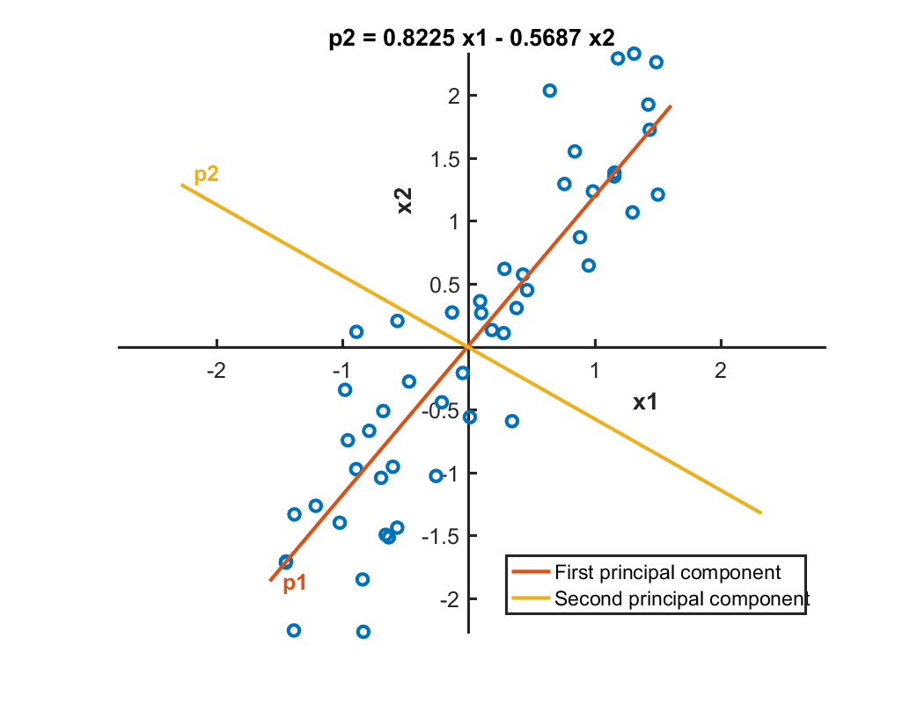

Table of Contents
- [Finding Patterns in Data](#finding-patterns-in-data)
  - [1. Low Dimensional Visualisation](#1-low-dimensional-visualisation)
    - [a. Dimensionality Reduction Techniques](#a-dimensionality-reduction-techniques)
    - [b. Multidimensional Scaling (MDS)](#b-multidimensional-scaling-mds)
      - [i. Classical MDS](#i-classical-mds)
      - [ii. Non-classical MDS](#ii-non-classical-mds)
    - [c. Principal Component Analysis (PCA)](#c-principal-component-analysis-pca)
      - [i. Result interpretation](#i-result-interpretation)

# Finding Patterns in Data

The goal of unsupervised learning problems is to identify the natural patterns or groupings in a dataset. As an example, let's examine a table containing information about basketball players:

| *Player* | Height | Weight | Points | Rebounds | Blocks | Assists |
| :--: | :--: | :--: | :--: | :--: | :--: | :--: |
| A | | | | | | |
| B | | | | | | |
| C | | | | | | |
| D | | | | | | |
| E | | | | | | |
| ... | | | | | | |
| Z | | | | | | |
|  | | | | | | |

On what basis can we divide the players? In basketball, players are divided into three groups of positions - Guards; Forwards and Centres. Teams generally rely on these three positions when choosing their players with the assumption that players who play the same position will have similar sets of skills and statistics. *But we don't know that ... yet.*

Back to our ML. With enforcing any prior knowledge about basketball, unsupervised learning can be used to divide the players' statistics into groups. Once we divide the players into groups, we can then examine whether these clusters correspond to the conventional positions in basketball.


## 1. Low Dimensional Visualisation
A quick and easy way tosee if the players can be grouped (based on their stats) is to visualise the data and see if there are any obvious trends or patterns. In order to effectively visualise data that contains more than 3 variables, we can use <b>dimensionality reduction techniques</b> such as multidimensional scaling and principal component analysis.

### a. Dimensionality Reduction Techniques
Visualising data in 2D or 3D is simple. However, ML problems involve myriads of dimensions which make visualisation a tricky task. Typically there is an internal structure to that data i.e. most of the information is in fact contained in fewer dimensions than the entirety of the data set. That is, it is possible to transform variables into a lower dimensional space without losing the integrity of information. For relatively small problems, it may be possible to visualise the transformed data in 2D or 3D to get an approximate representation of the data. 

<b>Principal Component Analysis (PCA)</b> and <b>Classical Multidimensional Scaling (cMDS)</b> are the two common ways in which we can potentially reduce the number of dimensions. Both methods are about building a new orthogonal coordinate system where the coordinates are ordered by importance. In PCA, the coordinates are in order of how much variance in the data they explain. It always transforms an <i>n</i>-dimensional space into another <i>n</i>-dimensional space. In MDS, they are ordered by how closely they preserve the pair-wise distances between observations. <i>n</i>-dimensional spaces are always transformed into the smallest space to preserve the pair-wise distances. Because of this, MDS can be used with any distance metric. For example, applying Euclidean space to MDS gives the same result as PCA. 

With both methods, it is possible to get a measure of the importance of each dimension in the new orthogonal coordinate system. This is typically visualised <i>in tandem</i> with a [Pareto chart](https://en.wikipedia.org/wiki/Pareto_chart) which shows each individual value as a bar + the running total as a line. We can use Pareto charts to determine how many dimensions we consider sufficient to obtain a reasonable approximation to the full data. If two or three dimensions are deemed sufficient, then just the first two or three coordinates of the transformed data can be plotted.

### b. Multidimensional Scaling (MDS)

#### i. Classical MDS

<b>Calculating pairwise distances</b>

In MATLAB, [`pdist`](https://au.mathworks.com/help/stats/pdist.html) function can be used to calculate the pairwise distance between the observations.

```matlab
% D: distance/dissimilarty vector containing the distance between each pair of
% observations. D is of length m(m-1)/2
%
% data: m x n numeric matrix containing the data. each of the m rows is
% considered an observation
%
% "distance": option input, indicates method of calculating the distance or
% dissimilarity. options: "euclidean" (default), "cityblock" and "correlation"  
>> D = pdist(data, "distance")
```

<b>Performing MDS</b>

Dissimilairity vectors can be used an input to the MATLAB function [`cmdscale`](https://au.mathworks.com/help/stats/cmdscale.html).

```matlab
% x: m x q matrix of the reconstructed coordinates in q-dimensional space
% q is the minimum number of dimensions needed to achieve the given pdist.
%
% e: eigenvalues of the matrix x * x'
% 
% D: see above
>> [x, e] = cmdscale(D)
```

Eigenvalues `e` can be used to determine if a low-dimensional approximation to the points in `x` provides a reasonable representation of the dat. If the first `p` eigenvalues are significantly larger than the rest, the points are well approximated by the first `p` dimensions i.e. the first `p` columns of `x`.

A typical workflow would resemble something like:
```matlab
load data
whos X
D = pdist(X);
[Y, e] = cmdscale(D);

% generate pareto
pareto(e)

% scatter 2D
scatter(Y(:,1), Y(:,2))

% scatter 3D
scatter3(Y(:,1), Y(:,2), Y(:,3))
```
to afford the following outputs:

Pareto


Scatter


Scatter 3D

#### ii. Non-classical MDS

The `cmdscale` function determines how many dimensions are returned in the configuration matrix. In order to find a configuration matrix with a specific number of dimensions, [`mdscale`](https://au.mathworks.com/help/stats/mdscale.html) function can be used:

```matlab
confMat = mdscale(distances,numDims)
```

### c. Principal Component Analysis (PCA)

As discussed earlier, another commonly used method for dimensionality reduction is PCA. In MATLAB, [`pca`](https://au.mathworks.com/help/stats/pca.html) function can be used to perform PCA:

```matlab
[pcs, scrs, ~, ~, pexp] = pca(data)
```


| Input | Description |
| :---: | :--- |
| `data` | *m* x *n* numeric matrix. *n* columns correspond to *n* observed variables. Each of the *m* rows corresponds to an observation |
|

| Output | Description |
| :---: | :--- |
| `pcs` | *n* x *n* matrix of principal components  |
| `scrs` | *m* x *n* matrix containing the data transformed using the linear coordinate transformation matrix `pcs` (first output) |
| `pexp` | A vector of length *n* containing the % of variance explained by each principal component |
|


#### i. Result interpretation

<center>

| | |
| :--- | :---:|
| Suppose that the input matrix `data` has two columns which contain values of the observed variables `x1` and `x2`. | |
|
</center>

We can perform the PCA using `pca` function as follows:

```matlab
[P, scrs,~,~,pexp] = pca(data)
```

The output matrix `P` contains the principal components, represented in terms of the original variables `x1` and `x2`. The first column of `P` contains the coefficients of the first principal component `p1`, and the second column contains the coefficients of the second principal component `p2`.

```matlab
P = 
    0.5687   0.8225
    0.8225  -0.5687
```

<center>

|||
| :---: | :---:|
|  |  |
|

</center>

The second output `scrs` is a matrix containing the observations in `data `expressed in the coordinate space of the principal components `p1` and `p2`. For example, a singla data point and its coordinate in the transformed space can be shown as the following:

<center>

| | | 
| :--- | :---: |
| `scrs(42,:)` |  |
|

</center>

Finally, the final output `pxep` is a vector containing the percent variance explained by each principal component. 

<center>

 | | |
 | :--- | :--- |
 | `pexp = 95.6706  4.3294` | `scrs(:,1)` |
 |  |  |
 |

</center>
