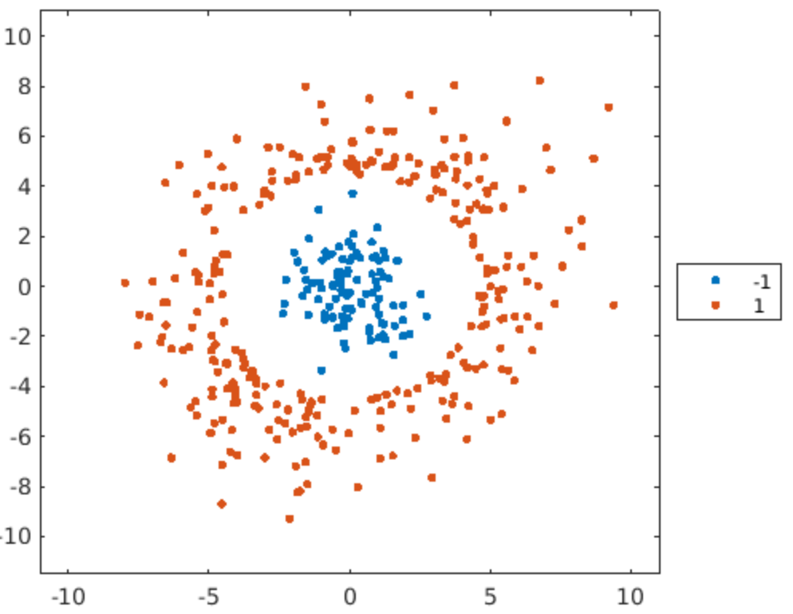
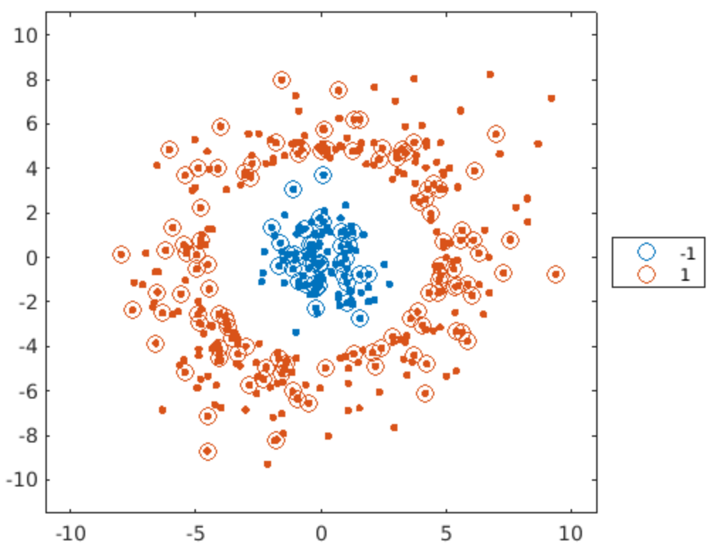

Table of Contents

- [Classification Methods](#classification-methods)
  - [1. *k*-Nearest Neighbour](#1-k-nearest-neighbour)
  - [2. Decision Trees](#2-decision-trees)
    - [i. Example](#i-example)
  - [3. Naïve Bayes](#3-naïve-bayes)
    - [i. Example 1](#i-example-1)
    - [ii. Example 2 - Numerical & Categorical Data](#ii-example-2---numerical--categorical-data)
  - [4. Discriminant Analysis](#4-discriminant-analysis)
    - [i. Example 1](#i-example-1-1)
    - [ii. Example 2 - COPD Data (Numerical only)](#ii-example-2---copd-data-numerical-only)
  - [5. Support Vector Machines](#5-support-vector-machines)
    - [i. Example 1 - Concentric Data](#i-example-1---concentric-data)

# Classification Methods

Supervised learning problems have a specific goal. For example, a doctor may want to diagnose coronary heart disease. In this case, the goal is to use biometric and laboratory data to accurately predict whether a patient has heart disease or not. The ML model could then be used as a preliminary diagnostic tool - which reduces the need for unnecessary angiograms. Since the response is dichotomous, this is considered a <b>binary classification problem</b>. Typically, classification problems are comprised of any number of response classes. In case of medical diagnosis, the response could be one of several related conditions. On the other hand, an activity tracker could be trying to determine your activity - e.g. sitting, standing or exercising - from your movement.

Supervised learning typically requires multiple iterations of building and evaluating different models. The process generally begins with a dataset where the training data has a <u>known answer</u>. To diagnose a coronary condition, a dataset containing the measurements of those whose diagnosis has been confirmed can be used. Once the dataset is prepared, a type of model to train the data must be chosen. Once the model is trained, its performance must be evaluated. This is commonly done by comparing model predictions with the known responses. If the performance is poor, we can make adjustments to the various options for an algorithm or change the algorithm entirely. Once the model gives satisfactory results, we can then move onto making predictions on new data. 

This chapter will focus on training the data to different types of algorithms and evaluating them.

| Workflow  | Function in MATLAB |
| :---: | :---: |
| Data Preparation | `cvpartition`
| Determining Algorithm | `fitc___`
| Model Fitting | `fitc___`
| Model Evaluation | `loss`
| Model Update | `fitc___`
| Making Predictions | `predict`

See also: [Fundamentals in MATLAB Machine Learning](https://github.com/ponte-vecchio/machinelearning/blob/main/MATLAB/ML_mat_01_fundamental_tools_in_matlab_machine_learning.md)

## 1. *k*-Nearest Neighbour

One of the most straightforward ways of categorising a new sample is to find known samples that are similar to the new sample, and assign the new sample to the same class. Such is the idea behind <i>k</i>-nearest neighbour (*k*-NN) classification. Using *k*-NN implies that no assumptions about the underlying distribution of the data do not have to be made.

**Function**

[`fitcknn`](http://www.mathworks.com/help/stats/fitcknn.html)

Commonly Used Args

- `NumNeighbors`: Number of neighbours used for classification (default: 1)
- `Distance`: Metric used for calculating distances between neighbours
- `DistanceWeight`: Weighting given to different neighbours

**Performance**

| Fit Time  | Prediction Time | Memory Consumption |
|:---: | :---: | :---: |
| Fast| Fast, &propto; dataSize<sup>2</sup> | Small|


## 2. Decision Trees

A *k*-NN model requires that all predictors are numeric or all predictors are categorical. Many datasets contain both numerical and categorical predicotrs. If we have mixed predictors, *k*-NN cannot be used on all of the data. Decision trees, on the other hand, do not make any assumptions about the data and allow a mixture of numerical and categorical predictors.

Binary decision trees classify observations by generating a sequence of Y/N questions - much like the [twenty questions game](https://en.wikipedia.org/wiki/Twenty_questions). For a given training data, the decision tree is built by considering all the possible splits in each variable. Using a given criterion for how good a potential split is, the best possible split is chosen. The process then repeats at the next level of the tree until all the branches eventually terminate which occurs when no further splits on that branch can improve the criterion value. This process is called [recursive partitioning](https://en.wikipedia.org/wiki/Recursive_partitioning). The end result divides up the predictor space into a collection of rectangular regions. Once the classifier is trained, making predictions becomes extremely quick because it requires nothing more than a couple binary decisions. In general, trees are a good choice when <b>there is a significant amount of missing data</b>.


| <b>Advantages</b>|
| :--- |
| Simple to understand
| Can handle both numeric/categorical data
| Simple data preparation
| Uses white-box model
| Can be validated using statistical modelling
| Can handle large datasets well
| Mirrors human decision making
| Robust against co-linearity
| In-built [feature selection](https://en.wikipedia.org/wiki/Feature_selection)
| Can approximate boolean operators

| <b>Limitations</b>|
| :--- |
| Trees are non-robust
| Small changes in training data leads to a large change in tree
| Over-complex trees leading to overfitting


Real data will always have some noise. In theory, a sufficiently complex tree could fit an arbitrarily complex boundary between points. However, this generally means that the model may overfit the data. That being said, pruning a tree is also possible. Tree pruning reduces the number of splits to create a simpler model that may have a higher re-substitution loss but superior generalisation to new data.

**Function**

[`fitctree`](http://www.mathworks.com/help/stats/fitctree.html)

Commonly Used Args

- `SplitCriterion`: Formula used to determine optimal splits at each level
- `MinLeafSize`: Minimum number of observations in each leaf node
- `MaxNumSplits`: Maximum number of splits allowed in the decision tree

**Performance**

| Fit Time | Prediction Time | Memory Consumption |
|:---: | :---: | :---: |
| &propto; dataSize | Fast | Small |


### i. Example

```matlab
%% Load and format data
heartData = readtable("heartData.txt");
heartData.HeartDisease = categorical(heartData.HeartSiease);

% partition data into training and test set
pt = cvpartition(heartData.HeartDisease, "HoldOut", 0.3);
hdTrain = heartData(training(pt), :);
hdTest = heartData(test(pt), :);

% fit using trees, calculate loss
model = fitctree(hdTrain, "HeartDisease");
spit(model, hdTest)
>> Training Error: 0.1070
Test Error: 0.2114


% prune if needed, then re-evaluate losses
model_prune_3 = prune(model, "Level", 3);
spit(model_prune_3, hdTest)
>> Training Error: 0.1271
Test Error: 0.1957

function [] = spit(model, testset)
    errorTrain = resubLoss(model);
    errorTest = loss(model, testset);
    disp("Training Error: " + errorTrain)
    disp("Test Error: " + errorTest)
end

```

## 3. Naïve Bayes 

*k*-NN and decision trees do not make any assumptions about the distribution of the underlying data. If it were to be assumed, then the data can be treated as a statistical sample. That is, the influence of the outliers on the model can be reduced. A naïve Bayes (pronounced like *nah-EVE BEY-z*) classification (NBC) assumes the independence of the predictors within each class. This classifier is a good choice for relatively simple problems. 

NBC works by assuming that the observations in each response class are samples from probability distributions - a separate distribution for each class. If probability distributions were known, then we could determine the probability of a new observation at its given location under the assumption that it belonged to a particular class.

<b>Probabilistic Model of NBC</b>

NB is a conditional probability model. For a problem instance vector <a href="https://www.codecogs.com/eqnedit.php?latex=\mathbf{x}&space;=&space;\left(&space;x_1,&space;x_2,&space;\dots&space;,&space;x_n&space;\right&space;)" target="_blank"></a> where *n* denotes number of features (independent variables), the conditional probability using Bayes' theorem can be decomposed to:

<a href="https://www.codecogs.com/eqnedit.php?latex=p&space;\left(&space;C_k&space;\mid&space;\mathbf{x}&space;\right)&space;=&space;\frac{p&space;\left(&space;C_k&space;\right&space;)p&space;\left(&space;\mathbf{x}&space;\mid&space;C_k&space;\right)}{p&space;\left(&space;\mathbf{x}&space;\right&space;)}" target="_blank"></a>

for each *K* possible outcomes or *classes*, <a href="https://www.codecogs.com/eqnedit.php?latex=C_k" target="_blank"></a>. That is,

<a href="https://www.codecogs.com/eqnedit.php?latex=\mathrm{posterior}&space;=&space;\frac{\mathrm{prior}&space;\cdot&space;\mathrm{likelihood}}{\mathrm{evidence}}" target="_blank"></a>

NBC combines the naïve Bayes probability model with a decision rule. One common rule is to pick the hypothesis that is most probable (known as <i>maximum a posteriori</i>, or MAP decision rule). The corresponding classifier, namely Bayes classifier, is the function that assigns a class label <a href="https://www.codecogs.com/eqnedit.php?latex=\hat{y}&space;=&space;C_k" target="_blank"></a> for some *k* as:

<a href="https://www.codecogs.com/eqnedit.php?latex=\hat{y}&space;=&space;\arg\max_{k&space;\in&space;\lbrace&space;1,&space;\dots&space;,&space;K&space;\rbrace}&space;p&space;(C_k)&space;\prod^{n}_{i=1}&space;p&space;\left(&space;x_i&space;\mid&space;C_k&space;\right&space;)" target="_blank"></a>

Consider three clusters, which are :apple:, :lemon: and :pear: scattered across a plot of two predictor variables. Typically we can calculate the probability of a class :apple: occuring  at a certain location :seedling:. 

  <i>p</i>( :seedling: | :apple: ) = 0.05

Bayes' theorem of conditional probabilities can reverse this and calculate the probability that the observation at :seedling: comes from the class :apple:. That is to say - given an observation :seedling: at a certain location, what is the probability that it is an :apple:? This can be represented as

  <i>p</i>( :apple: | :seedling: ) = <i>p</i>( :seedling: | :apple: ) * <i>p</i>( :apple: ) / <i>p</i>( :seedling: )

We can calculate this probability for each class - :apple:, :lemon: and :pear: - then clasify observation according to which class was the most likely. If, for example, we had these three probabilities:

  <i>p</i>( :apple: | :blossom: ) = 0.0000001

  <i>p</i>( :pear: | :blossom: ) = 0.47

  <i>p</i>( :lemon: | :blossom: ) = 0.63

then we can say that :blossom: is most likely to be a :lemon:. But this makes us ask - <i>how can the probability distributions be calculated?</i>

The "naïve" assumption in NBC is that each variable is <b>independent</b> in each response class. This is almost certainly not true, but it often works regardless and greatly simplifies the required calculations. Fitting a normal distribution in each variable independently involves a simple calculation of the mean and standard deviation for each combination of class and variable. Performing predictions only requires determining the probability of the observation & applying the formula from Bayes' theorem. Since an assumption is made that the distributions are independent in each predictor, the probability is the product of the probabilities in each variable. One benefit of this particular approach is that the probabilities give some indication of how clear the classification is. Additionally, because the predictions are based on the statistical distribution of all the observations (cf. individual observations), they are rather robust to noise in the training data. 

**Function**

[`fitcnb`](http://www.mathworks.com/help/stats/fitcnb.html)

Commonly Used Args

- `DistributionNames`: Distribution used to calculate probabilities

| Value | Description |
| :--- | :--- |
| `kernel` | Kernel smoothing density estimate |
| `mn` | Multinomial distribution. IF `mn` is specified, then all features are components of a multinomial distribution i.e. `mn` cannot be included as an element of a string array or a cell array of character vectors. |
| `mvmn` | Multivariate multinomial distribution. See [link](https://au.mathworks.com/help/stats/fitcnb.html#budugq6-13) |
| `normal` | Gaussian distribution |

- `Width`: Width of the smoothing window (when `DistributionNames` is set to `kernel`)

For *K* class levels and *P* predictors:
| Value | Description |
| :--- | :--- |
| *K*-by-*P* matrix of numeric values | Element (*k*, *j*) specifies the width for predictor *j* in class *k* |
| *K*-by-1 numeric **column** vector | Element *k* specifies the width for all predictors in class *k* |
| 1-by-*P* numeric **row** vector | Element *j* specifies the width in all class levels for predictor *j* |
| scalar | specifies the bandwidth for all features in all classes

- `kernel`: Type of kernel to use (default : `normal`)

For an indicator function *I{u}*,
| Value | Kernel | Formula | 
| :--- | :---: | :--- |
| `box` | Box (uniform) |  |
| `epanechnikov` | Epanechnikov |  |
| `normal` | Gaussian |  |
| `triangle` | Triangular |  |

**Performance**

| Distribution Type | Fit Time | Prediction Time | Memory Consumption |
| :--- |:---: | :---: | :---: |
| Normal | Fast | Fast | Small |
| Kernel | Slow | Slow | Moderate ~ Large |

### i. Example 1

```matlab
%% generate some data
load groups
rng(0)
part = cvpartition(groupData.group, "Holdout", 0.35);
dtTrain = groupData(training(part), :);
dtTest = groupData(test(part), :);
% plot true data
plotGroup(groupData, groupData.group, "x")

%% fit NB model using kernel dist
model_nb_kernel = fitcnb(dtTrain, "group", "DistributionNames", "kernel");
% For default Gaussian dist
model_nb_gauss = fitcnb(dtTrain, "group");

% predict response and calculate loss
predGroups = predict(model_nb, dtTest);
errSVM = loss(model_nb, dtTest);
disp("NB Loss: " + errSVM)

% plot predictions
hold on
plotGroup(dtTest, predGroups, "o")
hold off

%% function to use gscatter to create a formatted plot of grouped data
function plotGroup(data,grp,mkr)
    validateattributes(data,"table",{'nonempty','ncols',3})
    
    % Plot data by group
    colors = colororder;
    p = gscatter(data.x,data.y,grp,colors([1 2 4],:),mkr,9);
    
    % Format plot
    [p.LineWidth] = deal(1.5);
    legend("Location","eastoutside")
    xlim([-0.5 10.5])
    ylim([-0.5 10.5])
end
```

```matlab
Naive Bayes Loss: 0.11713
```
| |
| :---: |

### ii. Example 2 - Numerical & Categorical Data

```matlab
%% Load and format data
%  Read table from data
cardioData = readtable("cardioData.txt");
%  Set rows 12:22 into categoricals
cardioData = convertvars(heartData, 12:22, "categorical");

%% Partition data into training and test sets
part = cvpartition(cardioData.HeartDisease,"HoldOut", 0.3);
hdTrain = cardioData(training(part), :);
hdTest = cardioData(test(pt), :);

%% Fitting the model
%  use repmat to create string arrays with repeated values
k = repmat("kernel", 1, 11);
m = repmat("mvmn", 1, 10);

%  fitting the model using different dist function for different variable types
model_nb = fitcnb(hdTrain, "HeartDisease", "DistributionNames", [k, m]);
spit(model_nb, hdTest) % refer to spit function defined above
```

```matlab
Training Error: 0.17311
Test Error: 0.24039
```

## 4. Discriminant Analysis

Similar to NB, discriminant analysis (DA) works by assuming that the observations in each prediction class can be modelled with a normal probability distribution. However, no assumption of independence in each predictor is made. That is, a multivariate normal distribution is fitted to each class.

DA is quite similar to logistic regression (LR) and both can be used to answer the same research question. The key difference is that LR does not have as many assumptions and restrictions as DA. That being said, when DA's assumptions are met, it can be more powerful than LR. Unlike LR, DA can be used with small sample sizes. When sample sizes are equal and the homogeneity of variance/covariance holds, DA has been shown to be more accurate. Despite this, LR is the more popular choice because the assumptions of DA are rarely met. 

<b>Assumptions in DA</b>

The assumptions of DA are much like that of multivariate analysis of variance (mANOVA). It is quite sensitive to outliers and the size of the smallest group must be larger than the number of predictor variables.

  1. Multivariate normality: independent variables are normal for each level of the grouping variable.
  2. Homoscedasticity: homogeneity of covariance
  3. Multicollinearity: predictive power can decrease with an increased correlation between predictor variables.
  4. Independence: participants are assumed to be randomly sampled, and a participant's score on one variable is assumed to be independent of scores on that variable for all other participants.

<b>Concept</b>

DA uses the training observations to determine the location of a boundary between the response classes. The location of the boundary is determined by treating the observations of each class as samples from a multi-dimensional normal distribution.


In theory, we could fit an *n* dimensional normal distribution to the observations in each class - which involves calculating the <b>mean vector</b> (<i>&mu;</i>) and <b>covariance matrix</b> (&Sigma;) for each class. These determine the centre and the shape of the distribution respectively.

Having fitted the distribution, a boundary between the classes can be drawn by determining the set of points where the probabilities are equal (e.g. *p*( :pear: | :seedling: ) = *p*( :lemon: | :seedling: )). Observations on :pear: of the boundary would be classified as :pear" and observations found on :lemon: as :lemon:. All of this can be done theoretically that yields an equation for the boundary that relies on the parameters of the fitted distributions, such as:
 


Subsequently, the entire process of having to perform DA is not necessarily needed. All we only need to do is to

  1. Calculate the <i>&mu;</i> and the &Sigma; and;
  2. Apply the formula for the boundary.

If we assume that the distributions have the same shape (as in &Sigma;<sub>i</sub> = &Sigma;<sub>j</sub> = &Sigma;<sub>k</sub>) then the formula can be simplified greatly - the boundaries become linear. The coefficients of these linear boundaries can also be easily calculated from the individual class means and shared coviarance matrix of the observations. This makes linear discriminate analysis (LDA) quick and easy to perform. LDA works when the measurements made on independent variables for each observation are continuous quantities (As in, another technique called *discriminant correspondence analysis* must be used for categorical independent variables).

That being said, linear boundaries are not appropriate for all problems. If we assume that the covariance matrices are not the same for all classes (i.e. &Sigma;<sub>i</sub> &ne; &Sigma;<sub>j</sub> &ne; &Sigma;<sub>k</sub>), then the boundaries become quadratic and the coefficients are, again, determined by the mean vectors and covariance matrices of the observed classes. Quadratic discriminate analysis (QDA) is, therefore, still relatively quick but it requires more runtime and memory to calculate, store and invert the multiple covariance matrices, particularly when there are a lot of predictors and classes. 

Much like NB, the boundaries are based on the statistical distribution of all the observations cf. individual observations. That is, the boundaries are somewhat robust to noise in the training data. 

**Function**

[`fitscdiscr`](https://au.mathworks.com/help/stats/fitcdiscr.html)

<u>Common Options</u>

- `Delta`: coefficient threshold for including predictors in a linear boundary (default: 0)

- `DiscrimType`: type of boundary used (default: `linear`)

| Value | Description | Predictor &Sigma; Treatment |
| :--- | :--- | :--- |
`linear` | LDA | Same
`diaglinear` | LDA | Same, diagonal
`pseudolinear` | LDA | Same, inverted using pseudo inverse
`quadratic` | QDA | Different
`diagquadratic` | QDA | Different & diagonal
`pseudoquadratic` | QDA | Different & inverted using the pseudo inverse

- `Gamma`: regularisation to use when estimating the covariance matrix for linear DA. (range:`[0, 1]`)

    If `0` is specified, then no regularisation is applied to adjust the &Sigma; i.e. MATLAB will use the unrestricted, empirical covariance matrix. 

    If a value in the interval (0, 1) is specified, then LDA must be implemented. 

    If `1` is specified, then MATLAB will use maximum regularisation for &Sigma; estimation.


**Performance**

| Fit Time | Prediction Time | Memory Consumption |
| :---: | :---: | :---: |
| Fast, &propto; dataSize | Fast, &propto; dataSize | LDA: Small, QDA: Large-ish |

**Note**

LDA works well for "wide" data where there are more predictors than observations.

### i. Example 1

```matlab
%% Load and partition data
load groups
rng(0)
cvpt = cvpartition(groupData.group,"Holdout",0.35);
dataTrain = groupData(training(cvpt),:);
dataTest = groupData(test(cvpt),:);
plotGroup(groupData,groupData.group,"x")

%% Calculate loss and plot predictions
errDA = loss(mdlDA,dataTest);
disp("Discriminant Analysis Loss: " + errDA)
hold on
spit(dataTest,predGroups,"o")
hold off

%% Create model and predict
mdlDA = fitcdiscr(dataTrain,"group","DiscrimType","diaglinear","Gamma",0);
predGroups = predict(mdlDA,dataTest);

%% Function to create a plot of grouped data using gscatter
function spit(data,grp,mkr)
    validateattributes(data,"table",{'nonempty','ncols',3})
    
    % Plot data by group
    colors = colororder;
    p = gscatter(data.x,data.y,grp,colors([1 2 4],:),mkr,9);
    
    % Format plot
    [p.LineWidth] = deal(1.5);
    legend("Location","eastoutside")
    xlim([-0.5 10.5])
    ylim([-0.5 10.5])
end

```

### ii. Example 2 - COPD Data (Numerical only)

```matlab
data = readtable("COPDPredictions.txt");
data.COPD = categorical(data.COPD);

%% Partition data into training and test set
P = cvpartition(data.COPD, "HoldOut", 0.3);
train = data(training(P), :);
test = data(test(P), :);

%% Create model 
model_LDA = fitcdiscr(train, "COPD");
displayloss(model_LDA, test)

model_LDA_diag = fitcdiscr(train, "COPD", "DiscrimType", "diaglinear");
displayloss(model_LDA_diag, test)

model_LDA_diag_gamma0 = fitcdiscr(train, "COPD", "DiscrimType", "diaglinear", "Gamma", 0);
displayloss(model_LDA_diag_gamma0, test)

model_QDA = fitcdiscr(train, "COPD", "DiscrimType", "quadratic");
displayloss(model_QDA, test)

model_QDA_diag = fitcdiscr(train, "COPD", "DiscrimType", "diagquadratic");
displayloss(model_QDA_diag, test)

model_QDA_diag_gamma1 = fitcdiscr(train, "COPD", "DiscrimType", "diagquadratic", "Gamma", 1);
displayloss(model_QDA_diag_gamma1, test)

%% Calculate loss for training and test sets
function [] = displayloss(model, testset)
  train_E = resubLoss(model);
  test_E = loss(model, testset);
  disp("Training error: " + train_E)
  disp("Test error: " + test_E)
```

## 5. Support Vector Machines

Classifying data correctly is important in ML. In support vector machines (SVMs), a data point is viewed as a *p*-dimensional vector where  and we want to know whether we can separate such points with a (*p* - 1)-dimensional hyperplane. This is known as the <b>linear classifier</b>. Suppose we wanted to classify the given data below. There are many hyperplanes (&Eta;) that might classify the data, but the best hyperplane is the one that represents the largest separation (or margin) between two classes, i.e. &Eta;<sub>3</sub>. This can be thought of as the hyperplane whose distance from the nearest data point on each side is maximised - known as the <b>maximum-margin hyperplane</b> and the resulting linear classifier it defines is known as the <b>perceptron of optimal stability</b>.

<center>

<a href="https://commons.wikimedia.org/wiki/File:Svm_separating_hyperplanes_(SVG).svg#/media/File:Svm_separating_hyperplanes_(SVG).svg"></a>

</center>

If the data is actually linearly separable, then it results in a simple task of optimisation - choose the coefficients of the linear boundary to maximise the margin assuming that all observations are on the correct side of the boundary. Keep in mind that the optimal solution is determined only by the observations nearest to the boundary. These observations are referred to as the <b>support vectors</b>. 

Real data may not be linearly separable due to noise. That is, there may be no linear boundary that can correctly classify every observation. If such is the case, then we can modify the optimisation problem to maximise the margin but with a penalty term for misclassified observations. N.B. observations are correctly classified only if they lie on the correct side of the margin so the penalty term prevents a solution that cheats by having a huge margin. The SVM solution is the one that gives the best possible separation between the classes i.e. the widest margin without unnecessary misclassifications.

<b>Non-linear classification</b>

What if linear classification is appropriate for your classes/observations? SVMs can still be used for non-linear classification problems by performing a transformation of variables into a space where the classes are linearly separable. Such transformation in ML is called the <b>kernel machine</b>. The resulting algorithm is similar, except that every dot product is replaced by a non-linear kernel function. This allows the algorithm to fit the maximum-margin hyperplane in a transformed <b>feature space</b>. The linear classifier in the feature space can be converted back to original input space, yielding a non-linear classifier. It is noteworthy that working in a higher-dimensional feature space increases the generalisation error of SVMs. Some sommon kernels include:

| Kernel | Expression |
| :--- | :--- |
| Homogenous Polynomial |  |
| Heterogenous Polynomial |  |
| Gaussian radial basis function | 
| Hyperbolic tangent | 

<br>
<br>

**Function**

[`fitcsvm`](www.mathworks.com/help/stats/fitcsvm.html)

<u>Common Options</u>

- `KernelFunction`: types of kernel functions to apply

| Kernel Function Name | Description |
| :--- | :--- |
| `gaussian` or `rbf` | Gaussian/Radial Basis Function kernel, default for one-class learning
| `linear` | Linear kernel, default for two class learning |
| `polynomial` | Polynomial kernel. `PolynomialOrder` name-value needs to be used to specify a kernel of order *q*.

- `KernelScale`: scaling applied before the kernel transformaion (default: `1`)

    If `auto` is specified, then MATLAB selects an appropriate scale factor using a heuristic procedure. This procedure uses subsampling, resulting in varying estimate from one call to another. For reproducibility, set a random number seed using `rng` before training.

- `BoxConstraint`: Regularisation parameter controlling the misclassification penalty. (default: `1`)

**Performance**

<center>

| Fit Time | Prediction Time | Memory Consumption |
| :---: | :---: | :---: |
| Fast, &propto; dataSize<super>2</super> | Very Fast, &propto; dataSize<super>2</super> | Moderate |

</center>

**Note**

- SVMs use a distance based algorithm. For data that is not normalised, use the `Standardize` option. 

- Linear SVMs work well for "wide" data (more predictors than observations). 

- Gaussian SVMs often work better on "tall" data (more observations than predictors).

### i. Example 1 - Concentric Data

```matlab
%% Load, partition and plot the data
load data
rng(123)
cvpt = cvpartition(data.group,"Holdout",0.38);
trainPoints = data(training(cvpt),:);
testPoints = data(test(cvpt),:);
plotGroup(data,data.group,".")
```

<center>



</center>

```matlab
%% Devise a model and calculate loss
% since the data is concentric, polynomial kernel function would be wise
mdl = fitcsvm(trainPoints, "group", "KernelFunction","polynomial")
mdl_loss = loss(mdl, testPoints)

%% Plot predicted groups
predGroups = predict(mdl,testPoints);
plotGroup(points,points.group,".")
hold on
plotGroup(testPoints,predGroups,"o")
hold off

%% function
function plotGroup(data,grp,mkr)
    validateattributes(data,"table",{'nonempty','ncols',3})
    
    % Plot data by group
    colors = colororder;
    p = gscatter(data.x,data.y,grp,colors([1 2 4],:),mkr,9);
    
    % Format plot
    [p.LineWidth] = deal(1.25);
    legend("Location","eastoutside")
    xlim([-11 11])
    ylim([-11.5 11])
end
```

```matlab
mdl_loss =
    0
```

<center>



</center>