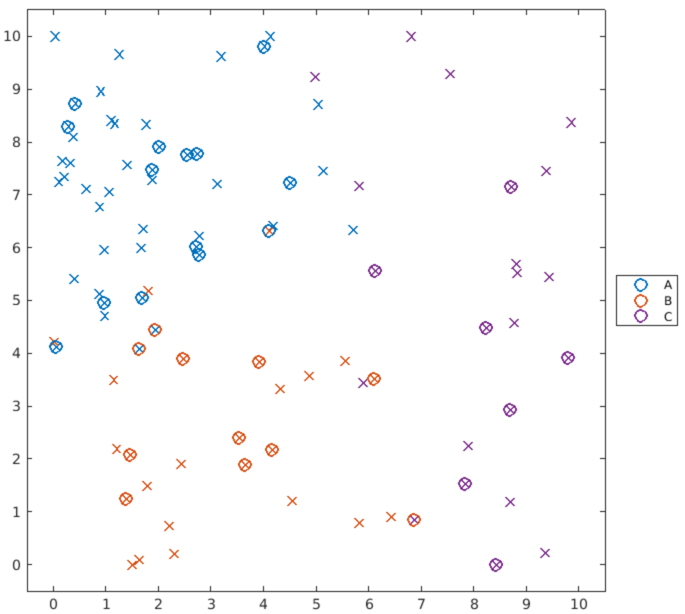

Table of Contents

- [Classification Methods](#classification-methods)
  - [1. *k*-Nearest Neighbour](#1-k-nearest-neighbour)
  - [2. Decision Trees](#2-decision-trees)
    - [i. Example](#i-example)
  - [3. Naïve Bayes](#3-naïve-bayes)
    - [i. Example 1](#i-example-1)
    - [ii. Example 2 - Numerical & Categorical Data](#ii-example-2---numerical--categorical-data)
  - [4. Discriminant Analysis](#4-discriminant-analysis)

# Classification Methods

Supervised learning problems have a specific goal. For example, a doctor may want to diagnose coronary heart disease. In this case, the goal is to use biometric and laboratory data to accurately predict whether a patient has heart disease or not. The ML model could then be used as a preliminary diagnostic tool - which reduces the need for unnecessary angiograms. Since the response is dichotomous, this is considered a <b>binary classification problem</b>. Typically, classification problems are comprised of any number of response classes. In case of medical diagnosis, the response could be one of several related conditions. On the other hand, an activity tracker could be trying to determine your activity - e.g. sitting, standing or exercising - from your movement.

Supervised learning typically requires multiple iterations of building and evaluating different models. The process generally begins with a dataset where the training data has a <u>known answer</u>. To diagnose a coronary condition, a dataset containing the measurements of those whose diagnosis has been confirmed can be used. Once the dataset is prepared, a type of model to train the data must be chosen. Once the model is trained, its performance must be evaluated. This is commonly done by comparing model predictions with the known responses. If the performance is poor, we can make adjustments to the various options for an algorithm or change the algorithm entirely. Once the model gives satisfactory results, we can then move onto making predictions on new data. 

This chapter will focus on training the data to different types of algorithms and evaluating them.

| Workflow  | Function in MATLAB |
| :---: | :---: |
| Data Preparation | `cvpartition`
| Determining Algorithm | `fitc___`
| Model Fitting | `fitc___`
| Model Evaluation | `loss`
| Model Update | `fitc___`
| Making Predictions | `predict`

See also: [Fundamentals in MATLAB Machine Learning](https://github.com/ponte-vecchio/machinelearning/blob/main/MATLAB/ML_mat_01_fundamental_tools_in_matlab_machine_learning.md)

## 1. *k*-Nearest Neighbour

One of the most straightforward ways of categorising a new sample is to find known samples that are similar to the new sample, and assign the new sample to the same class. Such is the idea behind <i>k</i>-nearest neighbour (*k*-NN) classification. Using *k*-NN implies that no assumptions about the underlying distribution of the data do not have to be made.

**Function**

[`fitcknn`](http://www.mathworks.com/help/stats/fitcknn.html)

Commonly Used Args

- `NumNeighbors`: Number of neighbours used for classification (default: 1)
- `Distance`: Metric used for calculating distances between neighbours
- `DistanceWeight`: Weighting given to different neighbours

**Performance**

| Fit Time  | Prediction Time | Memory Consumption |
|:---: | :---: | :---: |
| Fast| Fast, proportional to dataSize^2 | Small|


## 2. Decision Trees

A *k*-NN model requires that all predictors are numeric or all predictors are categorical. Many datasets contain both numerical and categorical predicotrs. If we have mixed predictors, *k*-NN cannot be used on all of the data. Decision trees, on the other hand, do not make any assumptions about the data and allow a mixture of numerical and categorical predictors.

Binary decision trees classify observations by generating a sequence of Y/N questions - much like the [twenty questions game](https://en.wikipedia.org/wiki/Twenty_questions). For a given training data, the decision tree is built by considering all the possible splits in each variable. Using a given criterion for how good a potential split is, the best possible split is chosen. The process then repeats at the next level of the tree until all the branches eventually terminate which occurs when no further splits on that branch can improve the criterion value. This process is called [recursive partitioning](https://en.wikipedia.org/wiki/Recursive_partitioning). The end result divides up the predictor space into a collection of rectangular regions. Once the classifier is trained, making predictions becomes extremely quick because it requires nothing more than a couple binary decisions. In general, trees are a good choice when <b>there is a significant amount of missing data</b>.

<center>

| <b>Advantages</b>|
| :--- |
| Simple to understand
| Can handle both numeric/categorical data
| Simple data preparation
| Uses white-box model
| Can be validated using statistical modelling
| Can handle large datasets well
| Mirrors human decision making
| Robust against co-linearity
| In-built [feature selection](https://en.wikipedia.org/wiki/Feature_selection)
| Can approximate boolean operators

| <b>Limitations</b>|
| :--- |
| Trees are non-robust
| Small changes in training data leads to a large change in tree
| Over-complex trees leading to overfitting

</center>

Real data will always have some noise. In theory, a sufficiently complex tree could fit an arbitrarily complex boundary between points. However, this generally means that the model may overfit the data. That being said, pruning a tree is also possible. Tree pruning reduces the number of splits to create a simpler model that may have a higher re-substitution loss but superior generalisation to new data.

**Function**

[`fitctree`](http://www.mathworks.com/help/stats/fitctree.html)

Commonly Used Args

- `SplitCriterion`: Formula used to determine optimal splits at each level
- `MinLeafSize`: Minimum number of observations in each leaf node
- `MaxNumSplits`: Maximum number of splits allowed in the decision tree

**Performance**

| Fit Time | Prediction Time | Memory Consumption |
|:---: | :---: | :---: |
| Proportional to the dataSize | Fast | Small |

### i. Example

```matlab
%% Load and format data
heartData = readtable("heartData.txt");
heartData.HeartDisease = categorical(heartData.HeartSiease);

% partition data into training and test set
pt = cvpartition(heartData.HeartDisease, "HoldOut", 0.3);
hdTrain = heartData(training(pt), :);
hdTest = heartData(test(pt), :);

% fit using trees, calculate loss
model = fitctree(hdTrain, "HeartDisease");
spit(model, hdTest)
>> Training Error: 0.1070
Test Error: 0.2114


% prune if needed, then re-evaluate losses
model_prune_3 = prune(model, "Level", 3);
spit(model_prune_3, hdTest)
>> Training Error: 0.1271
Test Error: 0.1957

function [] = spit(model, testset)
    errorTrain = resubLoss(model);
    errorTest = loss(model, testset);
    disp("Training Error: " + errorTrain)
    disp("Test Error: " + errorTest)
end

```

## 3. Naïve Bayes 

*k*-NN and decision trees do not make any assumptions about the distribution of the underlying data. If it were to be assumed, then the data can be treated as a statistical sample. That is, the influence of the outliers on the model can be reduced. A naïve Bayes (pronounced like *nah-EVE BEY-z*) classification (NBC) assumes the independence of the predictors within each class. This classifier is a good choice for relatively simple problems. 

NBC works by assuming that the observations in each response class are samples from probability distributions - a separate distribution for each class. If probability distributions were known, then we could determine the probability of a new observation at its given location under the assumption that it belonged to a particular class.

<b>Probabilistic Model of NBC</b>

NB is a conditional probability model. For a problem instance vector <a href="https://www.codecogs.com/eqnedit.php?latex=\mathbf{x}&space;=&space;\left(&space;x_1,&space;x_2,&space;\dots&space;,&space;x_n&space;\right&space;)" target="_blank"></a> where *n* denotes number of features (independent variables), the conditional probability using Bayes' theorem can be decomposed to:

<a href="https://www.codecogs.com/eqnedit.php?latex=p&space;\left(&space;C_k&space;\mid&space;\mathbf{x}&space;\right)&space;=&space;\frac{p&space;\left(&space;C_k&space;\right&space;)p&space;\left(&space;\mathbf{x}&space;\mid&space;C_k&space;\right)}{p&space;\left(&space;\mathbf{x}&space;\right&space;)}" target="_blank"></a>

for each *K* possible outcomes or *classes*, <a href="https://www.codecogs.com/eqnedit.php?latex=C_k" target="_blank"></a>. That is,

<a href="https://www.codecogs.com/eqnedit.php?latex=\mathrm{posterior}&space;=&space;\frac{\mathrm{prior}&space;\cdot&space;\mathrm{likelihood}}{\mathrm{evidence}}" target="_blank"></a>

NBC combines the naïve Bayes probability model with a decision rule. One common rule is to pick the hypothesis that is most probable (known as <i>maximum a posteriori</i>, or MAP decision rule). The corresponding classifier, namely Bayes classifier, is the function that assigns a class label <a href="https://www.codecogs.com/eqnedit.php?latex=\hat{y}&space;=&space;C_k" target="_blank"></a> for some *k* as:

<a href="https://www.codecogs.com/eqnedit.php?latex=\hat{y}&space;=&space;\arg\max_{k&space;\in&space;\lbrace&space;1,&space;\dots&space;,&space;K&space;\rbrace}&space;p&space;(C_k)&space;\prod^{n}_{i=1}&space;p&space;\left(&space;x_i&space;\mid&space;C_k&space;\right&space;)" target="_blank"></a>

Consider three clusters, which are :apple:, :lemon: and :pear: scattered across a plot of two predictor variables. Typically we can calculate the probability of a class :apple: occuring  at a certain location :seedling:. 

  <i>p</i>( :seedling: | :apple: ) = 0.05

Bayes' theorem of conditional probabilities can reverse this and calculate the probability that the observation at :seedling: comes from the class :apple:. That is to say - given an observation :seedling: at a certain location, what is the probability that it is an :apple:? This can be represented as

  <i>p</i>( :apple: | :seedling: ) = <i>p</i>( :seedling: | :apple: ) * <i>p</i>( :apple: ) / <i>p</i>( :seedling: )

We can calculate this probability for each class - :apple:, :lemon: and :pear: - then clasify observation according to which class was the most likely. If, for example, we had these three probabilities:

  <i>p</i>( :apple: | :blossom: ) = 0.0000001

  <i>p</i>( :pear: | :blossom: ) = 0.47

  <i>p</i>( :lemon: | :blossom: ) = 0.63

then we can say that :blossom: is most likely to be a :lemon:. But this makes us ask - <i>how can the probability distributions be calculated?</i>

The "naïve" assumption in NBC is that each variable is <b>independent</b> in each response class. This is almost certainly not true, but it often works regardless and greatly simplifies the required calculations. Fitting a normal distribution in each variable independently involves a simple calculation of the mean and standard deviation for each combination of class and variable. Performing predictions only requires determining the probability of the observation & applying the formula from Bayes' theorem. Since an assumption is made that the distributions are independent in each predictor, the probability is the product of the probabilities in each variable. One benefit of this particular approach is that the probabilities give some indication of how clear the classification is. Additionally, because the predictions are based on the statistical distribution of all the observations (cf. individual observations), they are rather robust to noise in the training data. 

**Function**

[`fitcnb`](http://www.mathworks.com/help/stats/fitcnb.html)

Commonly Used Args

- `DistributionNames`: Distribution used to calculate probabilities

| Value | Description |
| :--- | :--- |
| `kernel` | Kernel smoothing density estimate |
| `mn` | Multinomial distribution. IF `mn` is specified, then all features are components of a multinomial distribution i.e. `mn` cannot be included as an element of a string array or a cell array of character vectors. |
| `mvmn` | Multivariate multinomial distribution. See [link](https://au.mathworks.com/help/stats/fitcnb.html#budugq6-13) |
| `normal` | Gaussian distribution |


- `Width`: Width of the smoothing window (when `DistributionNames` is set to `kernel`)

For *K* class levels and *P* predictors:
| Value | Description |
| :--- | :--- |
| *K*-by-*P* matrix of numeric values | Element (*k*, *j*) specifies the width for predictor *j* in class *k* |
| *K*-by-1 numeric **column** vector | Element *k* specifies the width for all predictors in class *k* |
| 1-by-*P* numeric **row** vector | Element *j* specifies the width in all class levels for predictor *j* |
| scalar | specifies the bandwidth for all features in all classes

- `kernel`: Type of kernel to use (default : `normal`)

For an indicator function *I{u}*,
| Value | Kernel | Formula | 
| :--- | :---: | :--- |
| `box` | Box (uniform) |  |
| `epanechnikov` | Epanechnikov |  |
| `normal` | Gaussian |  |
| `triangle` | Triangular |  |

**Performance**

| Distribution Type | Fit Time | Prediction Time | Memory Consumption |
| :--- |:---: | :---: | :---: |
| Normal | Fast | Fast | Small |
| Kernel | Slow | Slow | Moderate ~ Large |

### i. Example 1

```matlab
%% generate some data
load groups
rng(0)
part = cvpartition(groupData.group, "Holdout", 0.35);
dtTrain = groupData(training(part), :);
dtTest = groupData(test(part), :);
% plot true data
plotGroup(groupData, groupData.group, "x")

%% fit NB model using kernel dist
model_nb_kernel = fitcnb(dtTrain, "group", "DistributionNames", "kernel");
% For default Gaussian dist
model_nb_gauss = fitcnb(dtTrain, "group");

% predict response and calculate loss
predGroups = predict(model_nb, dtTest);
errSVM = loss(model_nb, dtTest);
disp("NB Loss: " + errSVM)

% plot predictions
hold on
plotGroup(dtTest, predGroups, "o")
hold off

%% function to use gscatter to create a formatted plot of grouped data
function plotGroup(data,grp,mkr)
    validateattributes(data,"table",{'nonempty','ncols',3})
    
    % Plot data by group
    colors = colororder;
    p = gscatter(data.x,data.y,grp,colors([1 2 4],:),mkr,9);
    
    % Format plot
    [p.LineWidth] = deal(1.5);
    legend("Location","eastoutside")
    xlim([-0.5 10.5])
    ylim([-0.5 10.5])
end
```

```matlab
Naive Bayes Loss: 0.11713
```
| |
| :---: |

### ii. Example 2 - Numerical & Categorical Data

```matlab
%% Load and format data
%  Read table from data
cardioData = readtable("cardioData.txt");
%  Set rows 12:22 into categoricals
cardioData = convertvars(heartData, 12:22, "categorical");

%% Partition data into training and test sets
part = cvpartition(cardioData.HeartDisease,"HoldOut", 0.3);
hdTrain = cardioData(training(part), :);
hdTest = cardioData(test(pt), :);

%% Fitting the model
%  use repmat to create string arrays with repeated values
k = repmat("kernel", 1, 11);
m = repmat("mvmn", 1, 10);

%  fitting the model using different dist function for different variable types
model_nb = fitcnb(hdTrain, "HeartDisease", "DistributionNames", [k, m]);
spit(model_nb, hdTest) % refer to spit function defined above
```

```matlab
Training Error: 0.17311
Test Error: 0.24039
```

## 4. Discriminant Analysis

